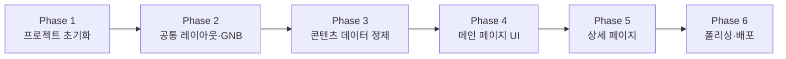

# WBS (Work Breakdown Structure) — 포트폴리오 웹사이트

> 기획서(`implementation_plan.md`)와 와이어프레임(`wireframes.md`)을 기반으로 작성된 작업 분해 구조입니다.
> 각 Phase는 순차적으로 진행하며, Phase 내 Task는 위에서 아래로 수행합니다.

---

## Phase 1. 프로젝트 초기화 및 기반 세팅

| # | Task | 상세 내용 | 산출물 |
|---|------|----------|--------|
| 1.1 | Next.js 프로젝트 생성 | `npx create-next-app` (App Router, TypeScript) | 프로젝트 스캐폴딩 |
| 1.2 | TailwindCSS 설정 | `@tailwindcss/typography` 플러그인 추가, 커스텀 테마(색상·폰트) 정의 | `tailwind.config.ts` |
| 1.3 | 폰트 설정 | Google Fonts에서 가독성 높은 산세리프 폰트(Inter/Pretendard) 적용 | `layout.tsx` |
| 1.4 | 프로젝트 디렉토리 구조 설계 | `app/`, `components/`, `data/`, `public/` 등 폴더 구조 확정 | 디렉토리 트리 |
| 1.5 | 아이콘 라이브러리 설치 | `lucide-react` 설치 | `package.json` |

---

## Phase 2. 공통 레이아웃 및 GNB 개발

| # | Task | 상세 내용 | 산출물 |
|---|------|----------|--------|
| 2.1 | 글로벌 레이아웃 구현 | `app/layout.tsx` — 본문 너비 제한(~800px), 오프화이트 배경, 여백 시스템 | `layout.tsx` |
| 2.2 | GNB 컴포넌트 | 로고(심성헌) + 네비게이션(Home, Experience, Projects). 반응형 대응 | `components/Header.tsx` |
| 2.3 | Footer 컴포넌트 | 간단한 저작권 표기 및 연락처/GitHub 링크 | `components/Footer.tsx` |
| 2.4 | 브라우저 검증 | 로컬 `npm run dev`로 레이아웃·GNB·Footer 렌더링 확인 | 스크린샷 |

---

## Phase 3. 콘텐츠 데이터 정제

| # | Task | 상세 내용 | 산출물 |
|---|------|----------|--------|
| 3.1 | 데이터 구조 설계 | 케이스 스터디 데이터의 TypeScript 인터페이스 정의 (slug, title, period, tags, summary, sections 등) | `types/` |
| 3.2 | 케이스 스터디 #1 데이터 작성 | `case_study_1` → 요약·문제 상황·해결 과정·결과 및 임팩트로 재구성 | `data/projects/` |
| 3.3 | 케이스 스터디 #2 데이터 작성 | `case_study_3` (기프트카드/Kafka) → 동일 구조로 재구성 | `data/projects/` |
| 3.4 | 케이스 스터디 #3 데이터 작성 | `case_study_4` (비관적 락) → 동일 구조로 재구성 | `data/projects/` |
| 3.5 | 케이스 스터디 #4 데이터 작성 | `case_study_2` (AOP/캐시) → 동일 구조로 재구성 | `data/projects/` |
| 3.6 | 경력 데이터 작성 | (주) 씽즈 (2년), 교보문고 (3년) 경력 요약 데이터 | `data/experience.ts` |

---

## Phase 4. 메인 페이지 UI 컴포넌트 개발

| # | Task | 상세 내용 | 산출물 |
|---|------|----------|--------|
| 4.1 | Hero Section | 자기소개 Placeholder + 핵심 서사 한 줄. 와이어프레임 기준 아바타 + 타이틀 레이아웃 | `components/Hero.tsx` |
| 4.2 | Experience Section | 타임라인 카드 (좌측 액센트 보더). 씽즈 → 교보문고 순서 | `components/Experience.tsx` |
| 4.3 | Project Card 컴포넌트 | 태그 + 제목 + 요약 + "Read More →" 링크. 2×2 그리드 배치 | `components/ProjectCard.tsx` |
| 4.4 | Projects Section | ProjectCard 4개를 그리드로 조합. 카드 클릭 시 상세 페이지(`/projects/[slug]`)로 이동 | `components/Projects.tsx` |
| 4.5 | 메인 페이지 조립 | Hero → Experience → Projects 순서로 섹션 조합 | `app/page.tsx` |
| 4.6 | 브라우저 검증 | 메인 페이지 전체 흐름 렌더링 확인 | 스크린샷 |

---

## Phase 5. 케이스 스터디 상세 페이지 개발

| # | Task | 상세 내용 | 산출물 |
|---|------|----------|--------|
| 5.1 | 동적 라우팅 설정 | `app/projects/[slug]/page.tsx` — slug 기반으로 데이터 로딩 | 라우팅 구조 |
| 5.2 | Article Header | 제목 + 메타데이터(기간만 표시) + 키워드 태그 배지 | 상세 페이지 상단 |
| 5.3 | Article Body | 요약 → 문제 상황 → 해결 과정 → 결과 및 임팩트. `prose` 클래스 활용한 타이포그래피 | 상세 페이지 본문 |
| 5.4 | Sticky TOC (목차) | 우측 사이드바 고정 목차. 현재 읽는 섹션 하이라이트 (Intersection Observer) | `components/TOC.tsx` |
| 5.5 | 브라우저 검증 | 상세 페이지 4개 모두 렌더링·목차 동작 확인 | 스크린샷 |

---

## Phase 6. 폴리싱 및 배포 준비

| # | Task | 상세 내용 | 산출물 |
|---|------|----------|--------|
| 6.1 | 반응형 디자인 | 모바일·태블릿 화면 대응. GNB 햄버거 메뉴, 카드 1열 배치 등 | 반응형 CSS |
| 6.2 | 마이크로 애니메이션 | 페이지 진입 Fade-in, 링크/카드 Hover 전환 효과 | Tailwind transition |
| 6.3 | 페이지 전환 효과 | 메인 → 상세 이동 시 부드러운 전환 애니메이션 | 전환 구현 |
| 6.4 | SEO 메타태그 | 각 페이지별 title, description, OG 태그 적용 | `metadata` 설정 |
| 6.5 | 최종 브라우저 검증 | 전체 플로우(메인 → 카드 클릭 → 상세 → 뒤로가기) 통합 테스트 | 최종 스크린샷 |
| 6.6 | Vercel 배포 준비 | `next build` 성공 확인, Vercel 배포 가이드 제공 | 빌드 결과 |

---

## 작업 흐름 요약

---

*작성: 2026-04-29*
