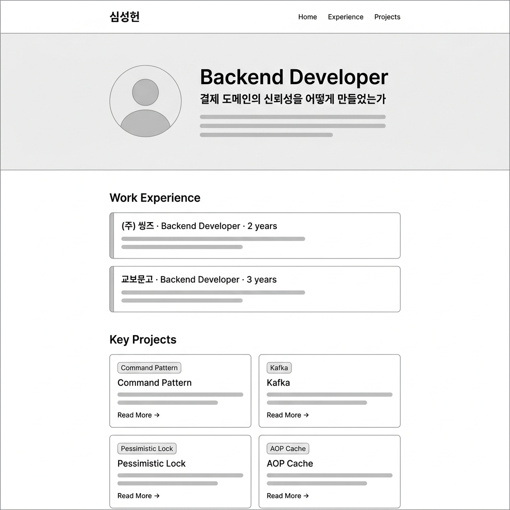
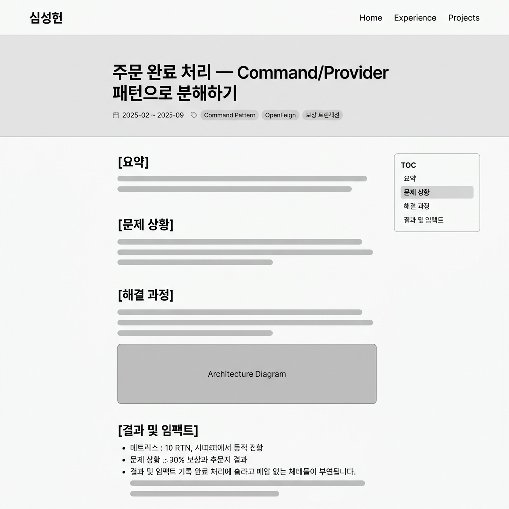

# 와이어프레임 — 포트폴리오 웹사이트

기획서(`implementation_plan.md`)를 기반으로 작성된 와이어프레임입니다.

---

## 1. 메인 페이지 (Home)

전체 흐름: **GNB → Hero (자기소개) → Work Experience (경력 요약) → Key Projects (케이스 스터디 카드 그리드)**

**구성 요소:**
- **GNB**: 로고(이름) + 네비게이션 링크 (Home, Experience, Projects)
- **Hero Section**: 아바타 + 직무 타이틀 + 핵심 서사 한 줄 + 간단한 자기소개 (Placeholder)
- **Work Experience**: 타임라인 카드 2개 — (주) 씽즈 (2년), 교보문고 (3년)
- **Key Projects**: 2×2 카드 그리드, 각 카드에 태그 + 제목 + 요약 + "Read More →"

---

## 2. 케이스 스터디 상세 페이지 (Case Study Detail)

기승전결 구조: **[요약] → [문제 상황] → [해결 과정] → [결과 및 임팩트]**

**구성 요소:**
- **Article Header**: 제목 + 메타데이터(기간만 표시) + 키워드 태그 배지
- **Article Body** (~700px 중앙 정렬): 요약 → 문제 상황 → 해결 과정(아키텍처 다이어그램 포함) → 결과 및 임팩트
- **Sticky TOC (우측 사이드바)**: 현재 읽고 있는 섹션을 하이라이트하는 고정 목차

---

*작성: 2026-04-29*
