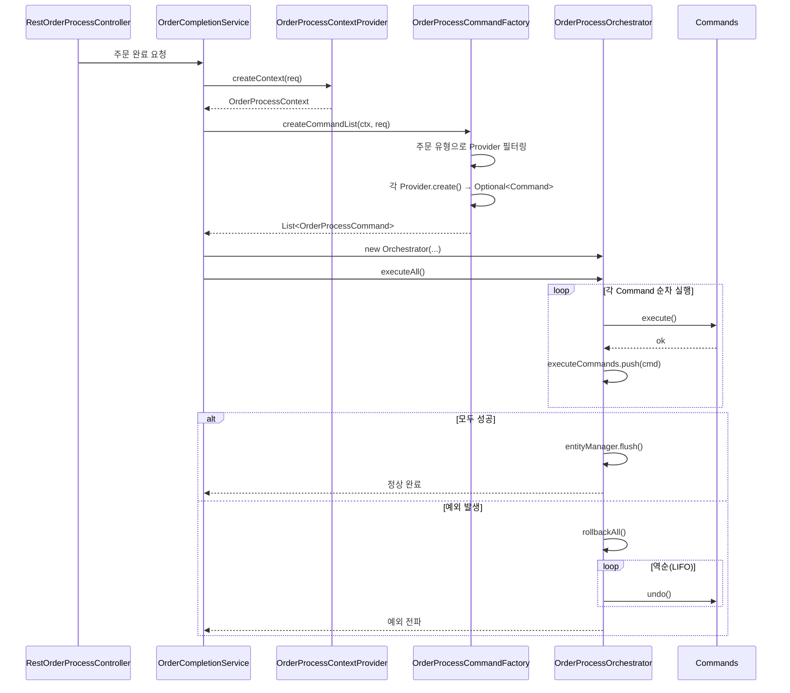
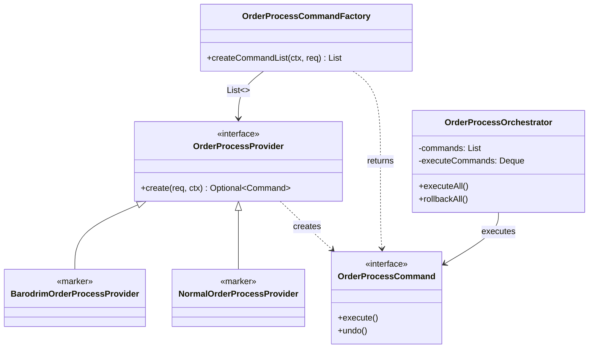

# 주문 완료 처리 — 거대 단일 메서드를 Command/Provider 패턴으로 분해하기

**기간** 2025-02 ~ 2025-09 (7개월) · **작업** 주문 완료 처리 리팩토링 · **커밋** 44건
**도메인** 주문 결제 (백엔드) · **기여** 단독 설계·구현
**스택** Java 11 / Spring Boot / JPA·Hibernate / Spring Cloud OpenFeign

---

## 배경 — 한 메서드가 수십 개 외부 시스템을 호출하고 있었다

주문 완료 처리는 사용자가 결제 버튼을 누른 뒤 일어나는 모든 일이다. 결제 연동 API 서버 복합 결제 승인, 예치금/통합포인트/e교환권/교보캐시/e캐시 차감, 쿠폰 사용 등록, SAM 이용권 주문 연동, 디지털 컨텐츠 서재 연동, 위버스 쿠폰 발급, 외서 발주 배송기일 업데이트, 핫트랙스 매입 처리, 바로드림 배송 요청, 판매 제한 수량 갱신, 주문 완료 일시 업데이트…

이 모든 것이 **하나의 거대 메서드**에 분기와 try/catch로 엮여 있었다. 새 결제수단을 추가할 때마다 메서드는 길어졌고, 어느 한 단계에서 예외가 발생하면 앞서 호출한 외부 시스템을 어떻게 되돌릴지가 코드에 명확히 드러나지 않았다. 부분 성공·부분 실패 가능성이 늘 깔려 있었다.

요구는 두 가지였다. **새 결제수단을 추가할 때 기존 코드를 건드리지 않을 것**, 그리고 **외부 시스템에 부분적으로만 영향을 미치는 상태로 끝나지 않을 것**.

## 본인의 역할

설계와 구현을 단독으로 진행했다. 7개월간 점진적 리팩토링 — 하루에 모두 바꾸는 빅뱅이 아니라, 외부 시스템 한 종류씩 옮겨 붙이며 운영을 안정적으로 유지했다. 코드리뷰는 팀원이 했고, 패턴 적용 방향성·인터페이스 설계는 본인이 결정했다.

## 기술 결정과 트레이드오프

세 가지 결정을 했다.

**1. Command + Provider 두 단계로 분리**

가장 큰 결정. Strategy 패턴이나 Chain of Responsibility로도 풀 수 있었지만, **외부 시스템 호출의 보상(rollback)**이 일급 시민이어야 했다. 외부 결제 승인 후 다음 단계가 실패하면 앞 결제를 취소해야 한다. 그래서 인터페이스에 `execute()`와 `undo()`를 같은 위계로 두는 Command 패턴을 택했다.

```java
public interface OrderProcessCommand {
    void execute();   // 정방향
    void undo();      // 역방향 (보상)
}
```

Command는 이렇게 단순하게 두고, **Command 객체를 어떻게 만들지(생성 조건 판단 + 데이터 준비)는 Provider가 책임**진다. 이렇게 분리하면 Command 객체 자체는 final + 불변으로 유지된다. Provider가 조회·검증·DTO 빌드를 끝낸 뒤 Command에 주입하므로, Command 안에서는 외부 호출과 undo만 신경 쓰면 된다.

**2. 마커 인터페이스로 주문 유형 분기**

바로드림(매장 픽업)과 일반 주문은 호출하는 외부 시스템 셋이 다르다. 처음에는 `if (isBarodrim) { ... } else { ... }`로 분기했지만, 분기를 컴파일 타임으로 옮기는 게 깔끔했다.

```java
interface OrderProcessProvider { ... }
interface BarodrimOrderProcessProvider extends OrderProcessProvider {}
interface NormalOrderProcessProvider   extends OrderProcessProvider {}
```

Factory에서 주문 유형에 따라 `instanceof` 한 줄로 필터링한다. Spring이 모든 Provider 구현체를 `List<OrderProcessProvider>`로 주입해주므로, **새 Provider를 추가할 때 Factory를 수정하지 않는다** (OCP 만족).

**3. RestTemplate → Spring Cloud OpenFeign 마이그레이션**

결제 연동 API 서버, 교보e캐시, 교보캐시, e교환권, 통합포인트, 예치금, SAM, 디지털 교환권, 위버스, 쿠폰 — 외부 호출이 흩어져 있었고 일부는 RestTemplate, 일부는 직접 HTTP 코드, 헤더 처리도 제각각이었다. **Feign으로 일원화**해서 인터페이스 추상화 + 응답 모델 타입 안전성을 확보했다. RequestContextHolder를 활용해 Request Scope 안에서 사내 인증 시스템 토큰을 캐싱했고, 동일 트랜잭션 내 중복 토큰 발급을 막았다.

## 아키텍처





핵심 동작 규칙은 두 가지다.

- **실행한 Command만 LIFO Deque에 쌓는다.** 정상 종료 시에만 `entityManager.flush()` — 중간 실패 시 DB 부분 반영을 막는다.
- **`BizRuntimeException`은 모니터링 alert 없이 rollback, 그 외 예외는 alert 발송 후 rollback.** 비즈니스 검증 실패와 시스템 장애를 구분해서 운영팀 노이즈를 줄였다.

## 결과

- **Command 21+, Provider 21+** 구현 완료. 결제수단 / 외부 시스템 / 부가 처리(외서 발주, 위버스 쿠폰 등) 각각이 단일 책임 단위로 분리됨.
- **새 결제수단 추가 = Command 1개 + Provider 1개**. 기존 OrderCompletionService와 Factory는 무수정.
- **롤백이 코드로 명시됨.** 어떤 Command가 어떤 보상을 갖는지 컴파일러가 강제 (인터페이스에 undo가 있으므로 미구현 시 컴파일 에러).
- **테스트 가능성 향상.** 각 Command를 독립적으로 단위 테스트할 수 있음 (이전에는 거대 메서드 전체를 모킹해야 했음).

> **운영 임팩트 데이터**: 운영 모니터링 캡처를 추가할 자리. 예) 주문 완료 처리 평균 지연 시간 개선치, 부분 실패로 인한 보상 운영 작업 발생 빈도 감소치 등. 사내 지표 가능 시 추가 예정.

## 배운 점

**Command와 Provider를 분리한 이유는 코드를 작성하면서 명확해졌다.** 처음에는 Command 안에서 자체적으로 데이터를 조회하게 했는데, 그러면 Command가 거대해지고 의존성이 늘어 단위 테스트가 어려워졌다. Provider로 생성 책임을 빼냈더니 Command가 final 필드만 가진 단순한 객체가 되었고, 테스트와 추적이 쉬워졌다.

**보상(undo)을 언어로 다루는 것이 가장 큰 가치였다.** "실패하면 어떻게 되돌릴 것인가"를 코드 작성 시점에 강제로 생각하게 만든다. 새 외부 시스템을 붙일 때마다 "이게 실패하면 어떻게 보상하지?"를 인터페이스가 묻기 때문에, 빠뜨리지 않는다.

**점진적 리팩토링의 가치.** 7개월에 걸쳐 한 외부 시스템씩 옮겨 붙였다. 빅뱅으로 한 번에 했다면 운영 사고 위험과 코드리뷰 부담이 컸을 것이다. Command/Provider 패턴은 "1개씩 추가" 친화적인 구조여서 이 작업 방식과 잘 맞았다.

**다시 한다면 다르게 할 것 — Saga 패턴 도입을 더 일찍 고려했을 것이다.** 현재 구조는 Orchestrator가 동기·인메모리 보상에 가까운데, 외부 시스템이 늘어나고 응답 시간이 길어질 경우 비동기 이벤트 기반 Saga로 발전시키는 게 자연스러운 다음 단계다. 7개월 작업 막바지에 그 필요성을 느꼈고, 후속 티켓에서 Provider/Context 구조가 그 방향으로의 디딤돌이 되도록 의도했다.

---

*아키텍처 다이어그램은 Mermaid로 작성. Excalidraw/draw.io 변환 시 동일한 시퀀스/클래스 관계 유지 가능.*
