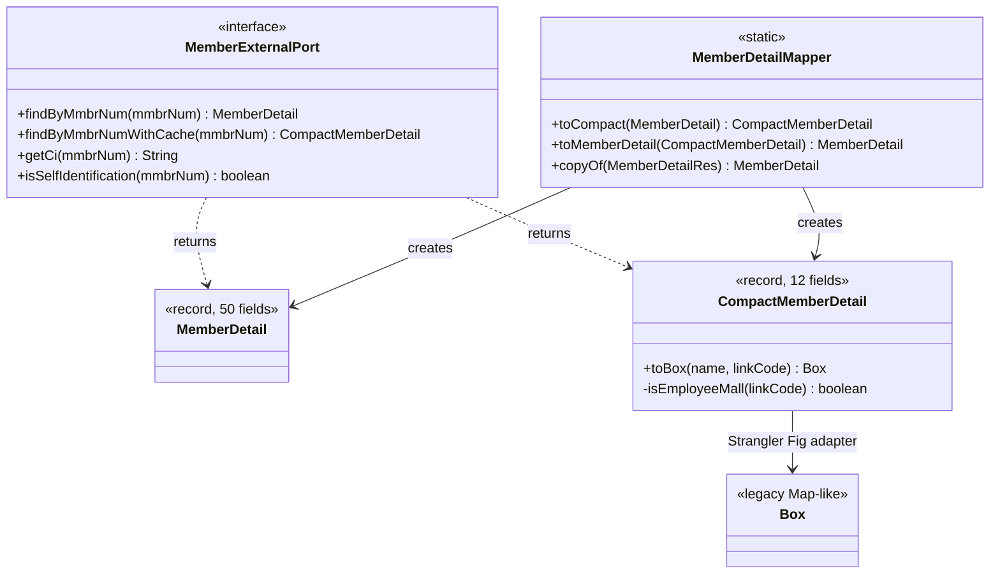
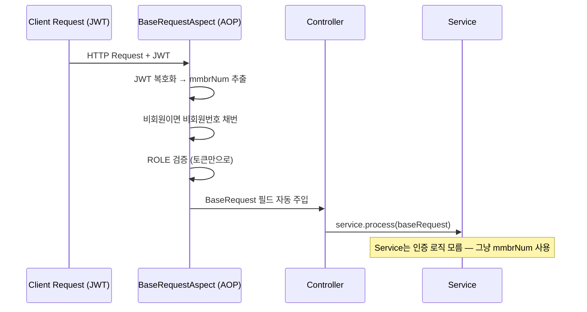
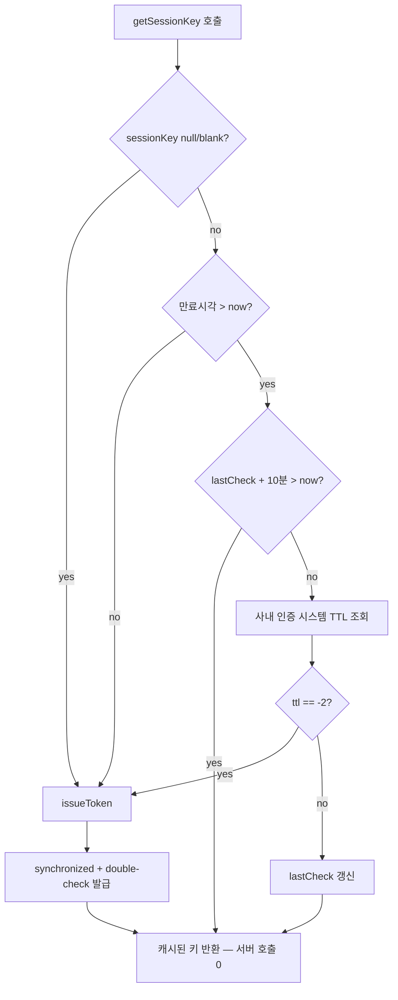

# 회원 인증 일원화와 캐시를 어디에 적용할지 결정하기

**기간** 2025-11 ~ 2026-03 (4개월) · **작업** 회원 인증 일원화 + 세션키 매니저 + 캐시 의사결정 · **커밋** 21건
**도메인** 공통 인프라 (백엔드) · **기여** 단독 설계·구현
**스택** Java 11 / Spring Boot / Spring AOP / Spring Cloud OpenFeign / Redis / Jackson 2.15 · Record

---

## 배경 — 무타입 `Box` 기반 코드 위에 인증·캐시 문제가 겹쳐 있었다

상황은 세 갈래였다.

**첫째, 회원 데이터가 `Box`(Map-like 무타입 컨테이너)로 흘러다니고 있었다.** 회원 정보가 `Box` 객체에 키-값으로 담긴 채 서비스 레이어를 가로질렀고, 키 이름은 SQL 컬럼명 그대로(`ordrCstmEmladrs`, `ordrCstmCphnTlnm` 등)였다. 컴파일러가 키 오타를 잡아주지 못했고, IDE 자동완성도 통하지 않았다. 호출자가 `Box`에 어떤 키가 들어 있는지 알려면 호출되는 서비스 코드를 까야 했다.

**둘째, 회원 인증 로직이 In-DTO마다 흩어져 있었다.** 컨트롤러에 들어오는 모든 요청 DTO가 회원 토큰을 들고 오는데, 토큰을 복호화해서 `mmbrNum`을 채번하고 비회원이면 비회원번호를 발급하는 코드가 DTO마다 또는 서비스 진입부마다 중복으로 돌고 있었다. 본인인증(self-identification) 여부 체크는 외부 API를 한 번 더 부르고 있었다.

**셋째, 사내 인증 시스템의 세션키 발급 API 호출이 잦았다.** 회원 정보를 사내 인증 시스템에서 조회하려면 세션키가 필요한데, 이 키를 매 요청마다 발급받고 있었다. 모니터링상 피크 시간대에 일간 **148K건 이상**의 호출이 단일 API에 집중되었다.

요구를 정리하면: **타입 안전한 도메인으로 회원 정보를 바꾸고**, **흩어진 인증 로직을 한 곳으로 모으고**, **세션키 발급 부담을 줄일 것**. 그리고 — 이게 이 케이스의 핵심 — **회원 정보 조회 자체에 Redis 캐싱을 적용할 것인가**라는 별도 결정이 있었다.

## 본인의 역할

설계와 구현 단독. 4개월간 점진적 적용. 캐시 도입 여부에 대한 최종 의사결정은 상위에서 내렸지만, 문제 분석과 두 가지 캐시 안(메모리/Redis)의 장단점 정리·코드 작성은 본인이 했다.

## 기술 결정과 트레이드오프

네 가지 결정 — 그리고 결정하지 않은 한 가지가 있었다.

**1. `Box` → typed record로 회원 도메인 마이그레이션 (다른 모든 결정의 토대)**

가장 먼저 손댄 것. AOP도 캐시도 그 위에 올라가는 것이라, 도메인이 typed가 아니면 깨끗하게 풀 수 없었다.

`MemberDetail`(50 필드, 외부 응답 매핑 풀 도메인)과 `CompactMemberDetail`(12 필드, 핵심 식별·연락·등급 정보) 두 record를 도입했다. 두 모델은 `MemberDetailMapper`로 양방향 변환된다. 외부 어댑터 응답(`MemberDetailRes`) → `MemberDetail` 매핑은 한 곳에 모았다.

가장 신경 쓴 포인트는 **레거시 `Box` 기반 코드와의 공존**이다. 한 번에 모든 호출자를 typed로 바꿀 수 없었기 때문에, `CompactMemberDetail`에 `toBox()` 어댑터 메서드를 추가했다.

```java
@JsonIgnore
public Box toBox(String callerOrdrCstmName, String linkDvsnCode) {
    Box box = BoxUtil.toBox(this);
    box.put("ordrCstmEmladrs", this.eml);            // 키 rename
    box.put("ordrCstmCphnTlnm", this.cphnTlnm);      // 키 rename
    box.put("ordrCstmName", isNotBlank(callerOrdrCstmName)
                            ? callerOrdrCstmName : this.mmbrName);
    box.put("emplyYsno",                              // 비즈니스 규칙 응집
            BooleanEnum.findByValue(isEmployeeMall(linkDvsnCode)).getCode());
    return box;
}

private boolean isEmployeeMall(String linkDvsnCode) {
    // emnm 보유 + JWT STAFF 역할 + 임직원 링크코드(EMK/EMH) 셋 다 만족
    ...
}
```

이건 **Strangler Fig 패턴**이다. 새 도메인은 typed로 가고, 레거시 호출자는 `toBox()`로 받아 기존 키 기반 로직을 그대로 유지한다. 이전에는 호출자마다 분기·키 rename·임직원 판정 로직이 흩어져 있었는데, `toBox()` 한 메서드에 모았다. 임직원 판정처럼 **여러 곳에서 헷갈리던 비즈니스 규칙을 도메인이 갖도록 응집**한 것이 본질적 가치.

**Port도 typed로 노출했다.**

```java
public interface MemberExternalPort {
    MemberDetail findByMmbrNum(String mmbrNum);                      // 50필드 풀
    CompactMemberDetail findByMmbrNumWithCache(String mmbrNum);      // 12필드, TTL 1h
    String getCi(String mmbrNum);
    boolean isSelfIdentification(String mmbrNum);
}
```

호출자는 자신이 필요한 만큼만 가져갈 수 있고, 시그니처에서 캐시 사용 여부가 드러난다. 캐시 정책(TTL 1시간 + 회원 등급 갱신 윈도우 우회)은 어댑터 구현체가 책임진다 — 호출자는 인터페이스만 보면 됨.



**2. AOP로 인증 책임을 횡단 관심사로 분리**

`BaseRequest` 추상 클래스를 만들고, 모든 In-DTO가 이를 상속하게 했다. `@Aspect`로 잡힌 `BaseRequestAspect`가 컨트롤러 진입 직전에 회원 토큰을 복호화해서 `mmbrNum`을 채워 넣고, 비회원이면 비회원번호를 채번한다. 본인인증 ROLE 검증도 회원 토큰만으로 끝내도록 바꿔서 외부 API 호출을 제거했다.



서비스 레이어는 `BaseRequest.getMmbrNum()`을 그대로 쓰면 된다. 이전에는 컨트롤러마다 토큰을 까는 보일러플레이트가 있었다.

**3. 사내 인증 시스템 세션키 — 메모리 캐시로 전환**

세션키는 **단일 키**이고 30일 TTL이 보장된다. 인스턴스마다 한 번 발급받아서 들고 있으면 모든 요청이 그것을 공유한다. 이런 패턴은 메모리 캐시가 정답이다.

`BoSessionKeyManager`를 만들고 3단 게이트를 두었다.



10분 휴리스틱을 둔 이유는 명확하다. 만료된 키를 최대 10분 사용할 위험 vs 서버 콜 95%+ 절감. 다운스트림에 재발급 fallback이 있어 안전하다고 판단했다. 발급 자체는 `synchronized` + double-check로 동시 다중 발급을 막았다.

**4. 회원 정보 — Redis 캐싱 적용을 검토했지만 도메인 특성상 보류**

가장 어려운 결정이었다. 그리고 **이 결정은 위 #1(typed 마이그레이션)과 분리해서 봐야 한다**.

먼저 **인프라는 깔았다**. typed record(`CompactMemberDetail`)가 있으니 `Jackson2JsonRedisSerializer<CompactMemberDetail>`로 Redis 직렬화가 깨끗하게 되었고, `OrderCacheConfig`에서 RedisTemplate를 정의했고, Key/TTL 상수도 중앙화했다. 12개 필드만 직렬화되므로 per-entry 약 2KB → 0.3KB 수준의 직렬화 페이로드를 확보할 수 있는 상태였다.

그런데 도메인 특성을 검토하는 단계에서 멈췄다. **교보문고 주문결제 도메인은 한 사용자가 결제 → 다음 결제까지의 텀이 길다.** 책 한 권 사고 다음 주문은 며칠~몇 주 뒤일 수 있다. 이 경우 다중키(회원별) Redis 캐시는 다음과 같이 동작한다:

- 조회 시점에 캐시 미스 → 사내 인증 시스템 호출 → Redis SET → 응답
- 다음 조회는 며칠 뒤 — 그 사이 TTL 만료되거나, 만료 안 됐어도 캐시 SET 비용은 이미 지불됨
- 결과적으로 캐시 SET 비용은 늘고, HIT은 거의 발생 안 함

상위에서 같은 분석을 거쳐 **장바구니 공통 처리(`CartCommonService`) 영역의 회원 정보 Redis 캐싱은 도입하지 않기로** 결정했다. 본인은 그 결정에 동의해 해당 호출 경로의 캐싱 적용을 제거했다 (2026-03-26).

다만 — 그래서 작업이 통째로 회수된 건 아니다. **#1의 typed 도메인 + Strangler Fig 어댑터(`toBox()`) + Port 분리 + Redis 직렬화 인프라는 모두 그대로 운영에 살아 있다.** 향후 다른 영역에서 캐시 히트율이 높을 만한 호출 패턴이 발견되면, 같은 인프라를 그대로 재사용해서 적용 결정만 다시 내리면 된다. 실제로 `MemberExternalPort.findByMmbrNumWithCache()` (TTL 1시간, 회원 등급 갱신 윈도우 우회)는 그렇게 적용 가능한 영역에서 활용되고 있다.

핵심은 — **같은 "캐싱"이라도 단일키 vs 다중키, 트래픽 패턴에 따라 적합성이 달라진다**는 것을 운영 데이터로 검증한 것. 그리고 **인프라 설치와 적용 결정을 분리해서, 인프라는 남기되 적용은 영역별로 판단**한 것.

## 운영 결과

### 운영에 살아 있는 구조 변화 (정성적)

| 변화 | 상태 | 효과 |
|---|---|---|
| 회원 도메인 typed record 도입 (`MemberDetail`, `CompactMemberDetail`) | 운영 반영 | 컴파일 타임 키 검증, IDE 자동완성, 매핑 한 곳 응집 |
| `MemberExternalPort` 두 메서드(typed) 분리 | 운영 반영 | 호출자가 캐시 사용 여부를 시그니처에서 인지 |
| `CompactMemberDetail.toBox()` Strangler Fig 어댑터 | 운영 반영 | 레거시 `Box` 호출자와의 점진적 마이그레이션 |
| 임직원몰 판정(`isEmployeeMall`) 등 비즈니스 규칙 도메인 응집 | 운영 반영 | 흩어진 분기 로직 1곳으로 통합 |
| AOP 기반 회원 인증 일원화 (`BaseRequestAspect`) | 운영 반영 | 컨트롤러/서비스의 인증 보일러플레이트 제거 |
| 본인인증 ROLE 검증 — 외부 API 호출 → 토큰 직판단 | 운영 반영 | 인입 요청 경로의 외부 호출 제거 |
| `BoSessionKeyManager` 메모리 캐시 (3단 게이트) | 운영 반영 | (아래 정량 수치) |
| Redis 캐싱 인프라 (`RedisTemplate<String, CompactMemberDetail>`, Key/TTL) | 운영 반영 (인프라만) | 적용 가능 영역에서 `findByMmbrNumWithCache`로 활용 |
| `CartCommonService` 회원 정보 Redis 캐싱 적용 | **보류** (도메인 적합성 검토 후 제거) | — |

### 사내 인증 시스템 세션키 발급 API — 정량 지표

배포는 4월 1일 오전 8시. 측정 대상은 사내 인증 시스템의 세션키 발급 엔드포인트.

**호출량 — 배포 시점 컷오프**

| 호출 주체 | 배포 직전 (5분 윈도) | 배포 직후 (5분 윈도) | 그 이후 |
|---|---|---|---|
| API 서비스 | 08:00 — 5,629건 | 08:06 — 40건 | **0건** |
| UI 서비스 | 08:05 — 2,059건 | 08:10 — 31건 | **0건** |

배포 5~10분 만에 두 호출 주체 양쪽 모두 0으로 수렴. 잔존 40·31건은 인스턴스 점진 교체 중 일부 트래픽이 구버전으로 흘렀던 것으로 추정된다.

**일간 누적 비교**

| 시점 | 일간 누적 | 비고 |
|---|---|---|
| 배포 전일 (03/31) | 42.25K | 14:00 시간대 누적 기준점 |
| 배포 당일 오후 (04/01) | 26.08K | 14:05까지 누적 — 사실상 배포 전 8시간 분량 |
| 단일 시점 피크 (배포 전, 03/31 22:00) | 148,762건 | 가장 트래픽 많은 시간대 |

**호출 평균 지연 32~35ms**가 인입 요청 경로에서 사라졌다. 즉, 모든 인입 요청이 평균 30ms+의 외부 의존을 덜고 응답하게 됐다.

이 데이터는 두 가지를 검증한다. (1) 단일키 메모리 캐시 설계가 캐시 히트율 ~100%를 달성했다. (2) 같은 모양의 캐시를 다중키(회원별) 회원정보에 적용했더라도 도메인 특성상 동일한 효과를 기대할 수 없었다는 분석이 옳았다.

## 배운 점

**도메인 모델링은 다른 모든 개선의 토대가 된다.** AOP도, 캐시도, 비즈니스 규칙 응집도, `Box`(무타입 Map) 위에서는 깔끔하게 풀리지 않았다. 처음에는 "캐싱을 도입한다"가 목적이었지만, 작업을 시작하니 **캐싱을 위해서라도 typed 도메인이 먼저** 필요했다. 결과적으로 캐싱 적용은 일부 영역에서만 살아남았지만, typed 도메인과 그 위에 올린 AOP·세션키 매니저·Strangler Fig 어댑터는 모두 영구적인 개선으로 남았다. **목적과 부산물이 뒤바뀐 셈이지만, 부산물 쪽이 더 큰 가치였다.**

**캐시는 만들 줄 아는 것보다 어디 적용할지가 더 중요하다.** 코드만 보면 두 캐시는 거의 같은 모양이지만, 적용 결과는 정반대다. 한쪽은 피크 148K건/일을 0으로 만들었고, 다른 쪽은 적용했어도 캐시 SET 비용만 늘렸을 가능성이 높았다. **단일키 vs 다중키, 트래픽 패턴, 재조회 텀 추정** — 이 세 가지가 적용 판단 기준이라는 걸 운영 데이터로 확인했다.

**상위 의사결정에 정렬할 줄 아는 자세도 엔지니어링이다.** 본인이 만든 코드를 회수하는 건 처음에는 아쉽다. 그러나 만든 사람이 곧 가장 정확한 판단자는 아니다. 도메인 특성·운영 비용·시스템 복잡도를 함께 보고 결정한 상위 판단에 맞춰 코드를 정리한 것이 결과적으로 시스템에 더 좋은 결정이었다. 이 자세가 시니어 엔지니어링의 한 면이라고 본다.

**AOP는 "흩어진 같은 일"에만 강력하다.** AOP를 인증 외에 다른 횡단 관심사(로깅, 트랜잭션 등)에도 확장하고 싶었지만, 동작 추적이 어려워질 수 있어 의도적으로 한 가지 책임만 맡겼다. 도구가 강하다고 다 쓰지는 않는다.

**다시 한다면 — 캐시 적용 가능성을 먼저 추정하고 코드를 짰을 것이다.** 이번에는 캐싱 코드를 만든 다음에 도메인 적합성을 검토했고, 결과적으로 일부 코드를 회수했다. 다음에는 **트래픽 패턴 추정 → 적합성 판단 → 구현 순서**로 가는 게 효율적일 것이다. 회수 자체는 가치 있는 경험이었지만 비용은 있었다.

---

*아키텍처 다이어그램은 Mermaid로 작성. 운영 데이터(피크 148K → 0)는 사내 APM 모니터링 캡처 출처. 외부 공개 시 수치 표기는 유지하되 캡처 이미지는 사내 자산이라 해상도 처리/익명화 검토 필요.*
