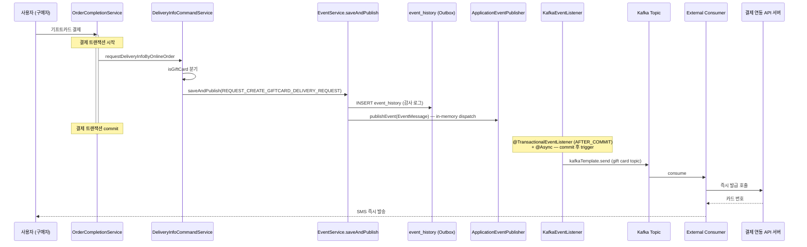
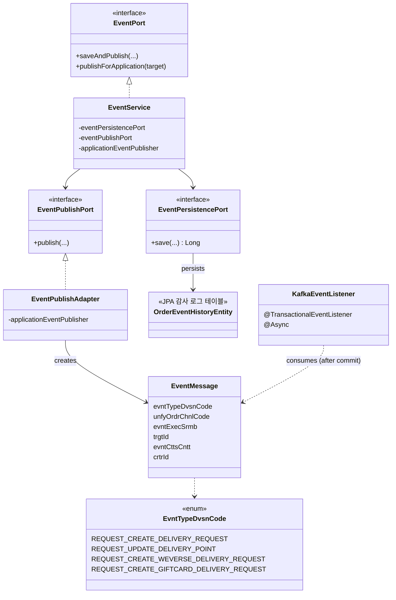

# 기프트카드 발급 — 결제와 발급 트랜잭션 분리 (Spring AFTER_COMMIT + 비동기 Kafka 발행)

**기간** 2024-04 ~ 2024-11 · **작업** 이벤트 발행 인프라 구축(4월) → 인프라 정착(5~6월) → 기프트카드 발급 적용(10~11월)
**도메인** 공통 인프라 + 주문 / 기프트카드
**기여** **Kafka 이벤트 인프라 AtoZ 단독 구축 + 기프트카드 발급 적용 주도** (배송 도메인은 팀 작업이라 도메인 지식으로만 활용)
**스택** Java 11 / Spring Boot / Spring Cloud OpenFeign / **Kafka** / Spring `@TransactionalEventListener` (AFTER_COMMIT) / `@Async` / JPA·Hibernate

> **패턴 명칭에 대한 정직한 표기**: 본 작업의 인프라는 종종 "트랜잭셔널 아웃박스 패턴"이라고 부르지만, 엄밀히 말하면 **Spring `@TransactionalEventListener`(AFTER_COMMIT) + `@Async` + 감사 로그 테이블** 조합으로 동작한다. CDC(Debezium 등)나 폴링 워커가 outbox 테이블을 읽어 발행하는 **순수 Transactional Outbox 패턴은 아니다**. `event_history` 테이블은 발행 후 재시도용이 아니라 감사·추적 용도. 이 차이는 한계 섹션에 명시.

---

## 배경 — 기프트카드 발급이 외부 배치 서버에 묶여 있었다

사용자가 기프트카드를 결제하면, 결제 완료 자체는 주문 API 서버에서 즉시 끝났다. 그런데 정작 **기프트카드 번호 발급**은 별도의 배치 서버가 주기적으로 주문 API 서버의 DB를 폴링해서 미발급 건을 모아 결제 연동 API 서버를 호출하는 구조였다. 폴링 주기 때문에 발급은 **최대 15분까지 지연**되었고, 그 사이에 사용자는 결제는 됐는데 카드 번호가 안 오는 회색 상태에 머물렀다.

요구는 간단했다. **결제 즉시 발급되도록**. 하지만 단순히 결제 트랜잭션 안에서 결제 연동 API 서버를 동기로 호출해버리면 안 됐다 — 외부 호출 실패가 결제 자체를 롤백시키거나, 결제는 됐는데 외부 호출은 실패한 부분 성공 상태가 생긴다. **결제 완료의 일관성과 발급의 즉시성을 동시에 보장하는 구조**가 필요했다.

배경 정보로 — 그 직전에 팀에서 **배송 요청 처리를 트랜잭션 분리하는 작업**을 진행 중이었다. 이 작업에 참여하면서 비슷한 문제(주문 완료와 외부 배송 시스템 연동의 분리)가 어떻게 풀리는지 익혔지만, 본인이 AtoZ로 주도한 건 아니었기 때문에 배송 도메인 자체에 대한 깊은 이해는 부족한 상태였다. 그 경험을 가지고 **기프트카드 발급은 본인이 처음부터 주도해서 같은 패턴으로 풀어보자**고 결정했다.

## 본인의 역할

**Kafka 이벤트 발행 인프라**(`EventMessage`, `EventPort`, `EventService`, `EventPublishAdapter`, `EventPublishPort`, `EventPersistenceAdapter`, `OrderEventHistoryEntity`, `KafkaEventListener`, `EvntTypeDvsnCode`)는 본인이 단독으로 설계·구현했다. 운영 코드의 `@author : SeongHeon Sim` 메타가 그대로 남아 있고, 핵심 클래스 8종이 모두 2024년 4월 9일 ~ 4월 11일 사흘 동안 작성되었다.

**기프트카드 발급에 이 인프라를 적용**하는 작업도 본인이 주도했다 — `EvntTypeDvsnCode`에 `REQUEST_CREATE_GIFTCARD_DELIVERY_REQUEST = "204"` 타입을 정의하고, `DeliveryInfoCommandService`에서 기프트카드 분기를 만들어 `eventPort.saveAndPublish(...)`를 호출하도록 했다. 외부 컨슈머는 이 토픽을 받아 즉시 결제 연동 API 서버에 발급을 호출한다.

**배송 도메인은 팀 작업**으로, 본인이 AtoZ로 한 게 아니라 같이 진행했다. 정직하게 표시하자면 인프라 + 기프트카드는 본인 단독, 배송은 도메인 지식으로 활용한 배경 경험이다.

## 기술 결정과 트레이드오프

### 1. 왜 Spring AFTER_COMMIT 기반 후처리 발행인가

가장 중요한 결정. 결제 트랜잭션과 발급(외부 시스템 호출)의 관계를 풀 때 옵션이 셋 있었다.

| 옵션 | 동작 | 문제 |
|---|---|---|
| **결제 트랜잭션 안에서 직접 Kafka 발행** | 같은 트랜잭션에서 `kafkaTemplate.send()` 호출 | DB는 commit 됐는데 Kafka 발행이 실패 → 메시지 손실 / Kafka 발행이 됐는데 DB는 rollback → 유령 메시지. **이중 쓰기 문제** |
| **결제 트랜잭션 안에서 직접 결제 연동 API 서버 호출** | 같은 트랜잭션에서 외부 발급 API 동기 호출 | 외부 시스템 응답 시간이 결제 응답 시간에 합산. 외부 장애 시 결제 자체 실패 |
| **Spring AFTER_COMMIT phase 후처리 발행** (선택) | 트랜잭션 안에서 ApplicationEvent 발행 + 감사 로그 INSERT. commit 직후 listener가 Kafka로 전송 | rollback 시 메시지가 외부로 안 새는 보장. 단 인스턴스 다운 시 손실 가능성은 남음 |
| (참고) **순수 Transactional Outbox (CDC 기반)** | 트랜잭션 안에서 outbox 테이블 INSERT. CDC(Debezium 등)가 commit log를 읽어 Kafka 발행 | 가장 강한 보장. 단 인프라 의존성 추가 |

**Spring AFTER_COMMIT 방식을 선택한 이유는 인프라 추가 부담 없이 이중 쓰기 문제의 가장 흔한 케이스(rollback ghost message)를 차단할 수 있었기 때문**이다. Spring `@TransactionalEventListener`의 디폴트 phase가 `AFTER_COMMIT`이라, **rollback된 트랜잭션의 이벤트는 listener가 호출되지 않아 Kafka로 안 새는 보장**이 된다.

**솔직한 한계 인정** — 이 방식은 순수 Transactional Outbox와 다음 두 가지 상황에서 차이가 난다:
- **인스턴스 다운**: commit 직후 `@TransactionalEventListener` 실행 전에 JVM이 죽으면 in-memory 이벤트가 사라져 Kafka로 안 나감. `event_history`에는 INSERT됐지만 그걸 읽어 재발행하는 메커니즘이 없음
- **Kafka 일시 장애**: `kafkaTemplate.send()`가 실패하면 메시지 손실. `event_history`는 감사 로그라 자동 재시도 안 됨

진짜 Outbox로 가려면 CDC(Debezium) 또는 별도 폴링 워커가 `event_history`를 읽어 미발행 메시지를 재발행해야 한다. 본 작업의 1차 목표("최대 15분 → 즉시")를 달성한 후 자연스러운 발전 방향으로 남겨둔 영역.

### 2. Spring `@TransactionalEventListener` + `@Async`로 비동기 발행

`@TransactionalEventListener`(AFTER_COMMIT phase) + `@Async` 조합이 본 인프라의 핵심 메커니즘.

```java
@Async
@TransactionalEventListener
public void eventListener(final EventMessage message) {
    var json = objectMapper.writeValueAsString(message);
    kafkaTemplate.send(kafkaTopicProperties.ordrDlvr(), message.getTrgtId(), json).get();
}
```

`@TransactionalEventListener`는 디폴트로 `AFTER_COMMIT` 시점에만 호출된다. 즉 **결제 트랜잭션이 commit되어야만 Kafka 송신이 trigger**된다. rollback되면 listener는 호출되지 않으므로 유령 메시지가 발생할 수 없다. `@Async`를 함께 붙여 결제 응답 시간이 Kafka 송신 RTT에 종속되지 않도록 했다.

별도 폴링 워커 프로세스를 처음부터 만들지 않은 이유 — 우리가 없애려던 게 외부 배치 서버의 폴링이었다. 새 폴링 시스템을 또 들이는 건 본 작업의 목표(폴링 의존성 제거)와 어긋났다. Spring 이벤트 + `AFTER_COMMIT`은 같은 JVM 내에서 commit phase 후처리를 표준 방식으로 처리해주는 가벼운 도구라, 1차 목표 달성에 적합했다. (한계 — 인스턴스 다운 시 손실은 후속 단계 CDC/폴링 워커로 보강할 자리)

### 3. EventMessage 제네릭 페이로드 설계

이벤트 페이로드는 **모든 도메인이 공유하는 단일 봉투** 구조로 갔다.

```java
public class EventMessage {
    private EvntTypeDvsnCode evntTypeDvsnCode;   // "201" 배송, "204" 기프트카드 발급, ...
    private UnfyOrdrChnlCode unfyOrdrChnlCode;   // 주문 채널
    private Long evntExecSrmb;                   // 이벤트 순번 (outbox PK 연계)
    private String trgtId;                       // 비즈니스 키 (Kafka partition key)
    private String evntCttsCntt;                 // JSON 직렬화된 도메인 페이로드
    private String crtrId;
}
```

도메인별 페이로드는 `evntCttsCntt`(JSON)에 담는다. 새 이벤트 타입을 추가할 때 EventMessage 자체는 수정하지 않고, `EvntTypeDvsnCode` enum에 코드만 추가하면 된다 — `REQUEST_CREATE_DELIVERY_REQUEST`(배송), `REQUEST_UPDATE_DELIVERY_POINT`(배송지 변경), `REQUEST_CREATE_WEVERSE_DELIVERY_REQUEST`(위버스), `REQUEST_CREATE_GIFTCARD_DELIVERY_REQUEST`(기프트카드)가 그렇게 늘어났다.

### 4. 별도 배치 서버 종료의 의사결정

기프트카드 발급이 Kafka 기반으로 안정화된 후, **별도 배치 서버의 폴링 잡을 비활성화**했다. 이건 단순한 정리가 아니라 의식적인 선택이었다.

- 같은 일을 두 경로(Kafka + 폴링)로 처리하면 중복 발급 위험
- 폴링 잡이 살아있으면 Kafka 컨슈머 장애 시 폴링이 fallback으로 잡아준다는 안전망 같지만, 실제로는 두 경로의 일관성을 유지하는 부담이 더 큼
- outbox에 이벤트가 영구 보존되므로 Kafka 컨슈머 장애 시 별도 재처리 도구로 outbox를 다시 발행하는 게 더 명확함

별도 서버 종료 = 운영 부담 감소 + 단일 실패 지점 제거.

## 아키텍처

### 호출 시퀀스



### 컴포넌트 관계



### 트랜잭션 경계 정리

| 단계 | 트랜잭션 | 보장 |
|---|---|---|
| `INSERT event_history` (감사 로그) | 결제 트랜잭션 내 | 비즈니스 변경과 이벤트 기록이 **원자적** (감사 추적용) |
| `applicationEventPublisher.publishEvent` | 결제 트랜잭션 내 (in-memory dispatch) | 같은 JVM 내 listener에 알림만, 실제 Kafka 송신은 아직 |
| `KafkaEventListener` (`@TransactionalEventListener` AFTER_COMMIT) | 결제 트랜잭션 commit 후 (별도 트랜잭션) | **rollback된 이벤트는 Kafka로 안 나감** — 유령 메시지 차단 |
| `kafkaTemplate.send` | 별도 비동기(`@Async`) | 결제 응답 시간 영향 0 |

> ⚠️ **본 구조의 한계**: `KafkaEventListener` 실행 직전에 JVM이 죽으면 in-memory `EventMessage`가 사라져 Kafka로 안 나감. `event_history`에는 INSERT됐지만 그걸 읽어 재발행하는 메커니즘이 없음. 진짜 Outbox로 가려면 CDC 또는 폴링 워커가 `event_history`를 monitoring해야 함.

## 결과

- **발급 지연: 최대 15분 → 즉시.** 사용자가 결제 직후 SMS로 카드 번호를 받음
- **별도 배치 서버 의존성 제거.** 운영 부담 감소 + 단일 실패 지점 제거
- **rollback ghost message 차단.** Spring `@TransactionalEventListener`(AFTER_COMMIT) 덕분에 결제가 rollback되면 Kafka로 메시지가 안 나감
- **결제 응답 시간 영향 0.** `@Async`로 Kafka 송신이 응답 시간에 합산 안 됨
- **감사 추적성 확보.** `event_history` 테이블에 모든 발행 이력 기록 — 운영팀이 추적 가능
- **재사용 가능한 인프라로 정착.** 같은 패턴이 위버스 배송(`REQUEST_CREATE_WEVERSE_DELIVERY_REQUEST`), 일반 배송(`REQUEST_CREATE_DELIVERY_REQUEST`), 배송지 변경(`REQUEST_UPDATE_DELIVERY_POINT`) 등으로 확장 적용됨

### 본 구조가 보장하지 않는 것 (정직한 한계)

- **JVM 다운으로 인한 메시지 손실**: 결제 commit 직후 `KafkaEventListener` 실행 전에 인스턴스가 죽으면 `EventMessage`가 in-memory에서 사라짐. `event_history`에는 INSERT됐지만 그걸 읽어 재발행하는 메커니즘이 없음
- **Kafka 일시 장애 시 자동 복구 X**: `kafkaTemplate.send()` 실패 시 `event_history`로부터 자동 재시도 안 됨. 운영 도구로 수동 복구 필요
- **순수 Transactional Outbox 보장은 미달**: CDC(Debezium) 또는 폴링 워커가 `event_history`를 모니터링해야 진짜 Outbox

→ 본 작업의 1차 목표("최대 15분 → 즉시" + "외부 배치 서버 종료")는 달성. 2차 robustness 향상은 후속 단계.

> **운영 임팩트 데이터 첨부 자리**: 발급 지연 시간 분포(P50/P99) 변화, 발급 실패율 변화, 별도 배치 서버 종료 후 운영 인시던트 변화 등. 사내 모니터링/지표 가능 시 추가 예정.

## 배운 점

**도메인 작업과 인프라 작업의 AtoZ 구분을 정직하게 표시하는 게 중요하다.** 배송 도메인은 팀 작업이라 본인의 도메인 지식이 깊지 않다 — 이걸 숨기면 면접에서 도메인 디테일을 물었을 때 막힌다. 인프라(`Event*` 클래스 + `KafkaEventListener`)는 본인이 단독으로 설계·구현했고, 그 인프라를 본인이 처음부터 끝까지 주도해서 적용한 것이 기프트카드 발급이다. 이렇게 구분하면 배송 도메인 질문이 나와도 "팀 작업으로 같이 했고 도메인 지식은 약하다"고 솔직하게 말할 수 있다.

**이중 쓰기 문제는 commit phase 분리로 가장 큰 부분이 사라진다.** "DB와 메시지 큐 둘 다 쓴다"는 일이 어쩐지 평범해 보이지만, 사실 분산 시스템에서 가장 흔한 데이터 정합성 사고의 원인이다. 결제 트랜잭션 안에서 Kafka로 직접 발행하면 rollback 시 유령 메시지가 발생하는데, Spring `@TransactionalEventListener`(AFTER_COMMIT)는 이 문제를 가장 가벼운 방식으로 차단해준다. 단, 인스턴스 다운까지 막으려면 진짜 Outbox(CDC + outbox table)가 필요하다는 점도 인정해야 한다.

**패턴 이름과 실제 구현을 정확히 구분하는 게 중요하다.** 본 인프라를 "트랜잭셔널 아웃박스 패턴"이라고 부르고 싶은 유혹이 있지만, 엄밀히 말하면 그건 아니다 — `event_history` 테이블이 발행 후 재시도용으로 읽히지 않으므로. **"Spring AFTER_COMMIT 기반 후처리 발행 + 감사 로그"** 가 정확한 표현이다. 면접에서도 이 차이를 정직하게 말하는 게 시니어 신호 — 패턴 이름만 외우는 게 아니라 "내가 만든 게 정확히 어떤 보장을 주고 어떤 보장은 안 주는지" 아는 것.

**같은 일을 두 경로로 처리하지 말 것.** 안전망처럼 보였던 폴링 + Kafka 이중 운영은, 실제로는 두 경로 간 상태 일관성을 유지하는 부담이 더 컸다. 외부 배치 서버 종료 후 — Kafka 컨슈머 장애가 발생하면 운영 도구로 `event_history`를 보고 수동 재발행하는 단순 운영 모델로 정리.

**다시 한다면 — CDC 기반 진짜 Outbox로 처음부터 설계했을 것이다.** 현재 구조는 "정상 경로"에서는 잘 동작하지만, JVM 다운 같은 엣지 케이스에서 메시지 손실 가능성이 남는다. CDC(Debezium)가 `event_history`를 monitoring하는 구조였다면 commit log 차원에서 발행 보장이 가능했을 것이다. 또한 idempotency key를 outbox에 처음부터 두고 컨슈머 멱등성도 함께 설계했다면 at-least-once 시멘틱에서 더 안전했을 것이다. 본 작업의 1차 목표(15분 → 즉시) 달성 후 자연스러운 발전 방향이 명확해서, 이 자체가 시니어 엔지니어링 관점의 "지금 어디까지 했고 다음은 무엇인가"를 면접에서 풀어낼 좋은 재료가 된다.

---

*아키텍처 다이어그램은 Mermaid로 작성. 운영 메트릭(15분 → 즉시) 출처는 사내 모니터링 — 외부 공개 시 캡처 처리/익명화 검토 필요.*
