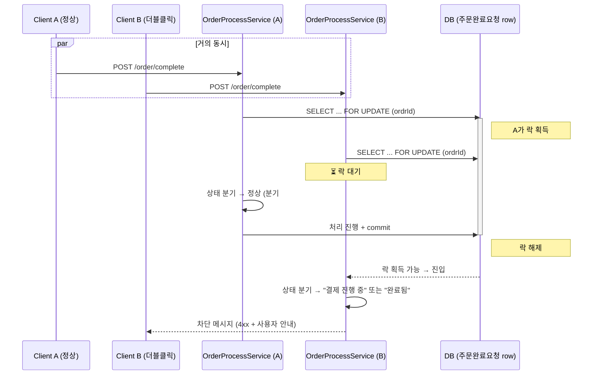
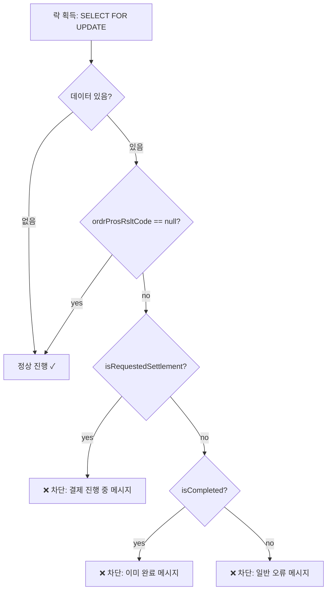

# 주문 완료 동시성 제어 — 한 번 되돌렸다가 비관적 락으로 다시 풀기

**기간** 2026-04 (약 3주) · **작업** 주문 완료 동시성 제어 · **커밋** 11건
**도메인** 주문 결제 (백엔드) · **기여** 단독 설계·구현
**스택** Java 11 / Spring Boot / JPA·Hibernate / `@Lock(PESSIMISTIC_WRITE)`

---

## 배경 — "왜 같은 주문이 두 번 처리되는가"

운영 중 같은 주문 ID에 대해 짧은 간격으로 주문 완료 요청이 두 번 들어오는 케이스가 발견됐다. 사용자가 결제 버튼을 더블클릭하거나, 네트워크 끊김으로 클라이언트가 재시도하거나, 결제 PG의 콜백이 중복으로 들어오는 등 원인은 다양했다. 결과는 같다 — **동일 주문이 두 번 완료 처리**되어 외부 시스템(결제 연동 API 서버, 포인트, 쿠폰, 배송)에 중복 호출이 나가고, 일부는 부분 성공/부분 실패로 끝난다.

요구는 단순했지만 트레이드오프가 까다로웠다. **중복 요청은 차단하되, 정상적인 후속 요청(예: 결제수단 변경 후 재시도)은 허용해야 한다.** 무조건 막아버리면 사용자가 결제수단을 바꾸고 다시 시도하는 일상적인 흐름까지 막힌다.

## 본인의 역할

설계와 구현 단독. 약 3주에 걸쳐 v1 → revert → v2 흐름이 git history에 그대로 남아 있다. 코드리뷰 사이클까지 포함해 11개 커밋. 솔직히 말해 **한 번 잘못 풀고 되돌린 경험**이 이 케이스의 가장 가치 있는 부분이다.

## 기술 결정과 트레이드오프

### v1 — 단순 차단으로 시작했다가 되돌림

처음 접근은 단순했다. 주문 완료 처리 진입부에서 "이 주문이 이미 처리 중이거나 완료된 상태인가"를 조회해서, 어느 쪽이든 해당하면 차단. 트랜잭션 격리 수준에만 의존한 단순 조회였다.

문제 두 가지가 운영 데이터를 보면서 드러났다.

1. **READ COMMITTED 격리에서는 두 동시 요청이 같은 "처리 안 됨" 상태를 동시에 읽을 수 있다.** 둘 다 통과해서 둘 다 처리 시작.
2. **결제수단 변경 → 재시도** 같은 정상 흐름까지 차단됐다. v1의 차단 로직이 너무 단순해서, "이전 시도가 결제 단계에서 실패해서 다시 시도하는 중"인 경우와 "동시 더블클릭"인 경우를 구분하지 못했다.

git에 `Revert "feat: 주문완료 중복 요청 방어 로직 개선"` + `Revert "fix: 주문완료 중복 요청 차단 로직 보완"` 두 커밋이 그대로 남아 있다. 이걸 숨기지 않고 케이스 스터디에 그대로 두는 게 좋다고 본다 — **운영 데이터를 보면서 자기 결정을 되돌릴 줄 아는 게 시니어 신호**라고 생각하기 때문이다.

### v2 — 비관적 락 + 상태 머신 분기

다시 설계할 때 두 축으로 풀었다.

**축 1: 락으로 동시성 직렬화.** 옵션은 셋이었다.

| 옵션 | 적합성 | 결정 |
|---|---|---|
| **낙관적 락 (Optimistic)** | 충돌 빈도 낮을 때 효율적 | 사용자 더블클릭은 충돌 빈도가 *높은* 케이스. 재시도 비용이 누적됨. **부적합** |
| **Redis 분산 락** | 멀티 인스턴스 환경에서 깔끔 | 인프라 의존성 추가. 락 누수(timeout 후 해제 실패) 처리 복잡. **과도** |
| **DB 비관적 락 (Pessimistic Write)** | 단일 row + 짧은 트랜잭션이면 효율적 | DB만으로 해결. 락 범위가 단일 row(주문완료요청 row)고, 트랜잭션이 짧음. **적합** |

비관적 락을 골랐다. JPA + JPQL로 한 줄.

```java
public interface OrderFinishRequestRepository extends JpaRepository<OrderFinishRequestEntity, String> {

    @Lock(LockModeType.PESSIMISTIC_WRITE)
    @Query("select ofr from OrderFinishRequestEntity ofr where ofr.ordrId = :ordrId")
    Optional<OrderFinishRequestEntity> findByOrdrIdForUpdate(@Size(max = 12) String ordrId);
}
```

DB 레벨에서 `SELECT ... FOR UPDATE`가 발생해 **동일 ordrId에 대한 동시 진입이 직렬화**된다. 락 범위는 단일 row로 한정해 다른 주문에는 영향이 없다.

**축 2: 락 획득 직후 상태 머신 분기로 정상 흐름 보존.**

락을 잡은 다음 곧바로 차단하면 결제수단 변경 같은 정상 흐름이 또 막힌다. 그래서 락 획득 후 **현재 처리 상태를 4가지로 분기**했다.

```java
@Override
@Transactional
public void validateOrderCompletionStatus(String ordrId) {
    Optional<OrderFinishRequest> optional =
            orderQueryPersistencePort.findOrderFinishRequestWithLock(ordrId);

    // 1) 데이터 없거나 처리 코드 없음 → 정상 (결제수단 변경도 허용)
    if (optional.isEmpty() || optional.get().ordrProsRsltCode() == null) {
        return;
    }

    OrderFinishRequest req = optional.get();

    // 2) 결제 진행 중 → 차단 (메시지 1)
    if (req.isRequestedSettlement()) {
        throw new BizRuntimeException(RES_VALIDATION, ORDER_FINISH_PROCESSING_MESSAGE);
    }

    // 3) 이미 완료됨 → 차단 (메시지 2)
    if (req.isCompleted()) {
        throw new BizRuntimeException(RES_VALIDATION, ORDER_FINISH_COMPLETED_MESSAGE);
    }

    // 4) 그 외 처리 코드 존재 → 차단 (메시지 3)
    throw new BizRuntimeException(RES_CD_ERROR, ERROR_ORDER_MESSAGE);
}
```

핵심은 **분기 1**. "처리 코드 없음" 상태는 **이전 시도가 결제 단계에서 실패해서 결제 정보가 다 비워진 정상 재시도** 케이스다. 이 경우는 통과시킨다. 그 외 결제 진행 중·완료·기타 상태는 각기 다른 메시지로 차단한다.

### 부수 결정 — 트랜잭션 propagation과 예외 매핑

`@Transactional` + `createOrderInfm()` 트랜잭션 적용을 보강하면서, 실패 케이스의 메시지/응답 매핑을 `OrderCompletionException`(별도 사용자 예외 클래스)으로 묶었다. 단일 진입점에서 락 → 검증 → 처리 → 예외 시 보상이 한 흐름으로 이어지도록.

## 아키텍처

### 동시 요청 시퀀스



### 상태 머신 (락 획득 직후 분기)



### 락 범위·트랜잭션 경계

| 항목 | 값 |
|---|---|
| 락 종류 | `LockModeType.PESSIMISTIC_WRITE` (DB `SELECT ... FOR UPDATE`) |
| 락 범위 | 단일 row (주문완료요청, ordrId 기준) |
| 락 보유 시간 | 트랜잭션 길이 (검증 + 후속 처리 commit까지) |
| 트랜잭션 경계 | `@Transactional` 메서드 1개. 짧게 유지 |
| 다른 주문 영향 | 없음 (row-level lock) |

## 결과

- 동일 주문 ID에 대한 동시 진입이 DB 레벨에서 직렬화됨
- 결제수단 변경 → 재시도 같은 **정상 흐름은 통과**, 동시 더블클릭은 **차단**
- 사용자가 받는 메시지가 상태별로 구분됨 (결제 진행 중/이미 완료/기타) — 운영 CS 부담 감소
- 코드리뷰 후 메서드 시그니처·트랜잭션 propagation 정비 (4월 27일 마지막 커밋: "중복 주문 방어 로직 코드리뷰 반영")

> **운영 임팩트 데이터 첨부 자리**: 중복 주문 처리로 인한 보상 운영(중복 결제 환불, 중복 포인트 차감 복구 등) 발생 빈도 변화. 사내 운영 지표 가능 시 추가 예정.

## 배운 점

**v1을 만들고 되돌린 경험이 가장 큰 가치였다.** 처음에 단순 차단으로 풀었을 때, 코드 자체는 간단했고 동작도 일견 맞아 보였다. 운영 데이터를 보고 나서야 (a) 격리 수준만으로는 동시성이 직렬화되지 않는다는 것 (b) 단순 차단은 정상 재시도 흐름까지 막는다는 것 두 가지를 알게 됐다. **데이터를 보지 않고는 풀 수 없는 문제가 있다는 걸 코드로 체감한 케이스.** 다음에 비슷한 동시성 문제를 만나면, 첫날부터 운영 로그를 옆에 두고 시작할 것이다.

**비관적 락이 무조건 비싸다는 건 미신이다.** 학교에서 배울 때는 비관적 락이 처리량을 떨어뜨리는 비싼 도구처럼 들리지만, **단일 row + 짧은 트랜잭션** 조건에서는 매우 합리적이다. Redis 분산 락이나 idempotency key 같은 멋진 도구를 먼저 떠올리기 전에, "DB만으로 풀 수 있는가"를 한 번 물어보는 습관이 생겼다.

**상태 머신 분기는 "차단 vs 통과"라는 이분법을 깨준다.** v1이 막힌 본질적 이유는 코드가 "이건 중복인가 아닌가"라는 이분법으로 짜여 있었기 때문이다. v2는 "지금 어떤 상태인가"라는 다분법으로 짜고, 각 상태에서 무엇을 허용하고 무엇을 차단할지 판단한다. 운영의 복잡한 요구는 대개 이분법보다 다분법이 더 잘 맞는다.

**다시 한다면 — Idempotency Key를 함께 도입했을 것이다.** 현재 구조는 동시 요청을 락으로 직렬화하지만, **시간차를 두고 들어오는 클라이언트 재시도**(예: 5초 후 재요청)는 락이 풀린 다음이라 락만으로는 못 막는다. 락 획득 후 상태 분기에서 "이미 완료" 케이스로 잡히지만, 더 깔끔한 방법은 클라이언트가 보낸 idempotency key를 서버에서 기억해서 같은 키의 두 번째 요청에는 첫 번째 응답을 그대로 돌려주는 것이다. 이건 후속 작업 후보로 메모해뒀다.

---

*아키텍처 다이어그램은 Mermaid로 작성. v1 revert → v2 재설계 흐름은 git history에서 검증 가능 (`Revert "..."` 2건, 이후 `feat: validateOrderCompletionStatus() 비관적 락 기반 동시성 제어 적용`).*
