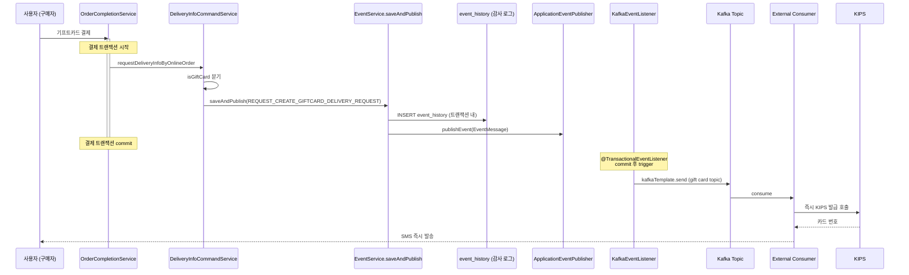
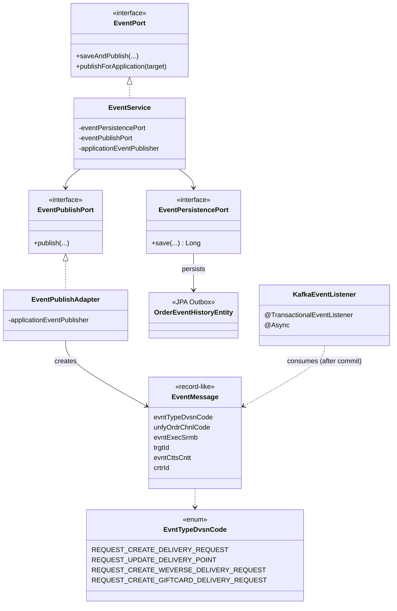

# Deep Dive — 5개 케이스 스터디 후보

> 각 후보별로 변경 파일·핵심 클래스·아키텍처 단서·다이어그램 재료를 정리. 회사 코드 직접 노출 없이 케이스 스터디 본문에 활용할 수 있는 구조 정보 위주.

레포: `fo-order-api`
헥사고날 아키텍처 명확 (`adapter/in`, `adapter/out`, `biz` UseCase, `domain`, `port/in`, `port/out`)
경로 패턴: `application/v2/**` (V2 신규 코드) vs `application/biz/**` (V1 레거시)

---

## 후보 #1 — INNO-4911 · 주문 완료 처리 Command/Provider 패턴 리팩토링

**기간**: 2025-02 ~ 2025-09 / **44 커밋** / **20+ 신규 클래스**

### 변경 핵심 파일

| 파일 | 역할 |
|---|---|
| `OrderProcessCommand.java` | **Command 인터페이스** — `execute()` + `undo()` |
| `OrderProcessOrchestrator.java` | **Orchestrator** — 모든 Command 순차 실행 + 실패 시 LIFO 역순 rollback |
| `OrderProcessCommandFactory.java` | **Factory** — 주문 유형(바로드림/일반)에 따라 Provider 필터링 |
| `OrderProcessProvider.java` | **Provider 인터페이스** — Command 생성 책임 |
| `BarodrimOrderProcessProvider.java` | 바로드림 전용 마커 |
| `NormalOrderProcessProvider.java` | 일반 주문 전용 마커 |
| `OrderProcessContext.java` | Command 간 공유 상태 (요청 데이터, URI, 가상계좌 여부 등) |
| `command/*.java` (20개) | KIPS 복합결제, 예치금/통합포인트/e교환권/교보캐시/e캐시/쿠폰/SAM/DGV/위버스 등 처리 단위 |
| `provider/*.java` (20개) | 각 Command에 대응하는 Provider |

### 핵심 구조

**Command 인터페이스 (4-line 인터페이스에 모든 책임 압축)**
```
interface OrderProcessCommand {
    void execute();   // 정방향
    void undo();      // 역방향(보상 트랜잭션)
}
```

**Orchestrator 동작 규칙**
- `commands` 리스트 순차 실행 → 실행한 것을 `executeCommands` Deque에 push
- 예외 발생 시 `rollbackAll()` → Deque를 pop하면서 역순 `undo()` 호출
- 모든 Command 성공 시 `entityManager.flush()` (한번에 DB 반영)
- 비즈니스 예외(`BizRuntimeException`)는 alert 없이 rollback, 그 외는 모니터링 alert 발송 후 rollback

**Factory 설계 포인트**
- Spring이 모든 Provider를 `List<OrderProcessProvider>`로 주입
- 주문 유형 분기는 `instanceof BarodrimOrderProcessProvider/NormalOrderProcessProvider` 마커 인터페이스로 처리
- 새 결제수단 추가 = Provider 1개 추가만 하면 됨 (기존 코드 무수정 = OCP 만족)

### 다이어그램 재료

**다이어그램 #1 — 주문 완료 처리 흐름**
```
RestOrderProcessController
        │
        ▼
OrderCompletionService (UseCase)
        │
        ├── OrderProcessContextProvider.createContext()
        │        ↓ OrderProcessContext (공유 상태)
        │
        ├── OrderProcessCommandFactory.createCommandList(ctx, req)
        │        ↓ List<OrderProcessCommand>
        │            (UseCouponCommand, ComplexPaymentCommand,
        │             DeductTotalPointCommand, RegistSamOrderCommand, …)
        │
        ▼
OrderProcessOrchestrator
        │
        ├── for each cmd: cmd.execute()  →  executeCommands.push(cmd)
        │
        ├── 정상 → entityManager.flush()
        │
        └── 예외 → rollbackAll()
                    while (!executeCommands.empty)
                        executeCommands.pop().undo()
```

**다이어그램 #2 — Provider/Command 관계 (Class 다이어그램)**
- `OrderProcessProvider` (interface) ← extends ← `BarodrimOrderProcessProvider`, `NormalOrderProcessProvider`
- 구현체: `ComplexPaymentProvider`, `DeductTotalPointProvider`, ... (각 20+개)
- 각 Provider.create() → `Optional<OrderProcessCommand>` (없으면 empty 리턴 → 흐름 자연 스킵)

### 케이스 스터디로 풀어낼 포인트
- "왜 Command + Provider 두 단계로 나눴나" — Command는 실행만, Provider는 생성 조건 판단·데이터 준비. 이렇게 분리하면 Command 객체는 final + 불변으로 유지 가능
- "왜 Strategy/Chain of Responsibility가 아닌 Command였나" — undo가 일급 시민이라야 했음 (외부 시스템 호출 보상)
- "마커 인터페이스로 분기하는 이유" — 주문 유형 코드를 if/switch로 분기하지 않고, 컴파일 타임에 어느 Provider가 어느 유형인지 명확
- "1차 캐시 문제 해결" — 모든 Command 성공 후 `flush()` 한 번 → 중간 실패 시 DB에 부분 반영 안 됨
- "FeignClient 마이그레이션" — 동일 티켓에서 RestTemplate 기반 호출을 OpenFeign으로 옮기며 인터페이스 추상화

---

## 후보 #2 — OSDT-2511-047 · 회원 인증 AOP & 세션키 매니저 (캐시 도입 검토 → 철회 의사결정 포함)

**기간**: 2025-11 ~ 2026-03 / **21 커밋**

> ⚠️ **중요한 정정** (사용자 피드백 반영):
> 이 티켓의 작업은 **두 갈래로 나누어 봐야 함**.
>
> **(A) 운영에 살아남은 구조 변화 — 본 케이스의 핵심 가치**
> - **회원 도메인을 `Box`(Map-like 무타입) → typed record(`MemberDetail`, `CompactMemberDetail`)로 마이그레이션** ← 핵심
> - `MemberExternalPort` typed 인터페이스 (두 메서드: 풀 도메인 / 캐시 경량 도메인)
> - `MemberDetailMapper`로 양방향 변환 (`toCompact()` / `toMemberDetail()` / `copyOf(MemberDetailRes)`)
> - `CompactMemberDetail.toBox()` Strangler Fig 어댑터 — 레거시 `Box` 호출자와의 점진적 공존
> - 임직원몰 판정(`isEmployeeMall`) 등 비즈니스 규칙을 도메인에 응집
> - AOP 기반 회원 인증 일원화 (`BaseRequestAspect`)
> - 본인인증 ROLE 검증 — 외부 API 호출 → 토큰 직접 판단
> - `BoSessionKeyManager` 메모리 캐시 (단일 키)
> - Redis 캐싱 **인프라**(RedisTemplate, Key/TTL 중앙화) — 적용 가능 영역에서 `findByMmbrNumWithCache`로 활용
>
> **(B) 적용이 보류된 한 부분**
> - `CartCommonService` 등 장바구니 공통 처리 영역의 회원 정보 Redis 캐싱 **적용**은 도메인 특성 검토 후 보류 (2026-03-26)
> - 사유: 한 사용자의 결제 → 재결제 텀이 길어 다중키 캐시의 히트율이 낮음
>
> → 따라서 케이스 스터디 본문에서 **"85% 감소"를 임팩트 헤드라인으로 쓰면 안 됨**. 헤드라인은 **"`Box` → typed record 마이그레이션 + AOP 인증 일원화 + 단일키 메모리 캐싱(BoSessionKeyManager) + 적용 영역 판단"**.

### 변경 핵심 파일 (운영 반영 / 미반영 구분)

| 파일 | 운영 반영 | 역할 |
|---|---|---|
| `MemberDetail.java` | ✅ | **신규 typed record** — 50필드 풀 회원 도메인 (외부 응답 매핑 대상) |
| `CompactMemberDetail.java` | ✅ | **신규 typed record** — 12필드 경량 회원 도메인. 비즈니스 규칙(`isEmployeeMall`) + 레거시 호환(`toBox()`) 응집 |
| `MemberDetailMapper.java` | ✅ | **신규** — `toCompact()` / `toMemberDetail()` / `copyOf(MemberDetailRes)` 매핑 한 곳 |
| `MemberExternalPort.java` | ✅ | **typed Port 인터페이스** — `findByMmbrNum` (풀) / `findByMmbrNumWithCache` (TTL 1h, 등급 갱신 윈도우 우회) |
| `MemberExternalAdapter.java` | ✅ | Port 구현체 — 캐시 정책은 어댑터 책임 |
| `BoSessionKeyManager.java` | ✅ | **신규** — BO 인증 세션키 메모리 캐싱·TTL 검증 매니저 |
| `BoAuthClient.java` | ✅ | Feign 클라이언트 (세션키 발급 + TTL 조회) |
| `BaseRequestAspect.java` | ✅ | **AOP** — In-DTO에 회원 토큰·비회원번호 자동 주입 |
| `BaseRequest.java` | ✅ | AOP 적용 대상 마커/베이스 |
| `SelfIdentificationInterceptor.java` | ✅ | 본인인증 인터셉터 |
| `OrderCacheConfig.java` | ✅ | Redis Key/TTL 중앙화 + `RedisTemplate<String, CompactMemberDetail>` 정의 (인프라는 살아 있음) |
| **`CartCommonService` 회원 정보 캐싱 적용** | ❌ 보류 | 도메인 적합성 검토 후 캐싱 호출 경로 제거 (2026-03-26) |

### 핵심 구조

**Box → typed record 마이그레이션 (모든 개선의 토대)** — *운영 반영*

작업의 시작점은 회원 데이터가 `Box`(Map-like 무타입 컨테이너)로 흘러다니던 레거시였다. 키 이름이 SQL 컬럼명 그대로(`ordrCstmEmladrs` 등)였고, 컴파일러가 키 오타를 잡아주지 않았으며, 임직원몰 판정 같은 비즈니스 규칙이 호출자마다 흩어져 있었다.

마이그레이션은 다음 4가지로 구성됨:

1. **typed record 도입**
   - `MemberDetail` (50 필드, 풀 도메인)
   - `CompactMemberDetail` (12 필드, 핵심 식별·연락·등급)
2. **`MemberDetailMapper`로 매핑 응집**
   - 외부 응답 → 풀: `copyOf(MemberDetailRes)`
   - 풀 ↔ 경량: `toCompact()` / `toMemberDetail()` (38 필드는 null 복원)
3. **typed Port — `MemberExternalPort`**
   - `findByMmbrNum` (풀) / `findByMmbrNumWithCache` (경량, TTL 1h, 등급 갱신 윈도우 우회)
   - 호출자가 캐시 사용 여부를 시그니처에서 인지
4. **Strangler Fig 어댑터 — `CompactMemberDetail.toBox()`**
   - 레거시 `Box` 기반 호출자와 점진 공존
   - 키 rename(`eml → ordrCstmEmladrs` 등) + 비즈니스 규칙(임직원몰 판정) 응집

이 마이그레이션이 **AOP / 세션키 매니저 / 캐싱 검토** 모두의 토대다. typed가 아닌 `Box` 위에서는 AOP 주입 타겟·캐시 직렬화 모두 깨끗하게 풀리지 않는다.

**BoSessionKeyManager 캐싱 전략 (3단 게이트)** — *운영 반영*
1. 로컬 메모리에 세션키 + 만료시각 + 마지막 서버확인시각 보관 (`volatile`)
2. 만료시각 < now → 즉시 무효
3. 마지막 서버확인 후 10분 이내 → 무조건 유효 (서버 호출 생략)
4. 10분 초과 → BO `getTtl()` 호출 → `-2` 응답 시만 무효
5. 무효 시 `synchronized` 블록에서 더블 체크 후 발급

→ **결과**: BO 세션키 발급 API 호출 빈도 획기적 감소. 이 캐시는 세션키 한 줄을 30일 TTL로 보유하는 **단일 키 캐시**라 도메인의 "재결제 텀이 길다" 이슈와 무관 (모든 트래픽이 단일 키를 공유).

**BaseRequestAspect (AOP) 효과** — *운영 반영*
- 다수 In-DTO에 흩어져 있던 `mmbrNum` 채번 / 회원 토큰 복호화 로직을 AOP에서 일괄 주입
- 컨트롤러/서비스는 `BaseRequest`를 상속받기만 하면 됨
- 본인인증 여부 체크 로직 간소화 (회원 토큰 통해서 직접 체크 → 불필요한 API 호출 제거)

**CompactMemberDetail 도입 검토 → 철회** — *케이스 스터디 본문에 핵심 서사로 사용*
- 설계: MemberDetail 50개 필드 중 실사용 12개만 record로 추림 → per-entry 약 2KB → 0.3KB (**설계상** 85% 감소)
- 캐시 저장/조회: `MemberDetailMapper.toCompact()` / `toMemberDetail()`
- **철회 결정 근거**: 주문결제 도메인은 단일 사용자가 결제 → 재결제까지의 텀이 길어 캐시 히트율이 낮음. 캐시 미스 시 BO 호출 + 캐시 SET 비용이 오히려 추가됨
- 결과적으로 운영 코드에서는 캐싱 호출 경로 제거. 다만 코드 자체는 잔존 (필요 시 다른 영역에서 재활용 여지)

### 다이어그램 재료

**다이어그램 #1 — 세션키 캐싱 게이트** (이 부분은 운영 반영)
```
Request → BoSessionKeyManager.getSessionKey()
              │
              ├── sessionKey == null/blank → issueToken()
              ├── now > expiryTime → issueToken()
              ├── now < lastCheckTime + 10min → return cached (서버 콜 0)
              └── BoAuthClient.getTtl() == -2? → issueToken() : update lastCheckTime
                                          ↓
                              issueToken() (synchronized + double-check)
```

**다이어그램 #2 — AOP 회원 정보 주입 흐름** (운영 반영, 이 다이어그램을 헤드라인으로)
```
[Client Request with JWT]
        │
        ▼
[Controller @PostMapping(...)]   ─── In-DTO extends BaseRequest
        │                                    ↑
        │                                    │ ① 인터셉트
        ▼                                    │
[BaseRequestAspect (AOP)]  ──────────────────┘
        │
        ├── JWT 복호화 → mmbrNum 추출
        ├── 비회원이면 비회원번호 채번
        ├── 본인인증 ROLE 검증 (외부 API 콜 제거 → 토큰만으로 판단)
        └── BaseRequest 필드에 자동 주입
        │
        ▼
[Service Layer]
   ── BaseRequest.getMmbrNum() 그대로 사용 (Service는 인증 로직 모름)
```

**다이어그램 #3 — 캐시 도입 검토 → 철회 의사결정** (스토리 서술용)
```
Step 1. 문제 식별
   - MemberDetail 조회 빈도 ↑, payload 50필드 ≈ 2KB
   - 다중 인스턴스 환경 → 메모리 캐시는 효과 제한적
   ↓
Step 2. 설계
   - record CompactMemberDetail (12 필드, ~0.3KB) 도입
   - Mapper로 양방향 변환
   - Redis Key/TTL 중앙화 (OrderCacheConfig)
   ↓
Step 3. 도메인 특성 검토 (상위 의사결정)
   - "한 사용자가 결제 → 다음 결제까지 텀이 길다"
   - 캐시 히트율 낮음 → 캐시 SET 비용 + 미스 시 원본 콜 = 부담만 증가
   ↓
Step 4. 결정 (2026-03-26)
   - 회원 정보 캐싱 호출 경로 제거
   - Redis Key/TTL 중앙화는 다른 캐시 영역에 유효하므로 유지
   - AOP 일원화 / SessionKey 매니저는 그대로 운영
```

### 운영 결과 (실측 지표)

> 배포 전후 BO 세션키 발급 API 호출량을 모니터링으로 직접 측정. 4월 1일 약 08:00 배포 기준.

**측정 대상 엔드포인트**: `/adp/api/v1/bologin/ext-user/session-key` (외부 BO 인증 서비스 호출)

#### 1. 호출 건수 — 배포 시점 컷오프

| 호출 주체 | 배포 직전 (5분 윈도) | 배포 직후 (5분 윈도) | 그 이후 |
|---|---|---|---|
| **API 서비스** | 08:00 — **5,629건** | 08:06 — 40건 | **0건** |
| **UI 서비스** | 08:05 — **2,059건** | 08:10 — 31건 | **0건** |

→ 배포 직후 5~10분 만에 트래픽이 사실상 0으로 수렴. 잔존 40건 / 31건은 인스턴스 점진적 교체 중 일부 트래픽이 구버전으로 흘렀던 것으로 추정.

#### 2. 일간 호출량 — 배포 전후 비교

| 시점 | 일간 누적 최대건수 | 비고 |
|---|---|---|
| **배포 전일 (03/31)** | **42.25K** (기준점) | 14:00 시간대 누적 |
| **배포 당일 오후 (04/01)** | **26.08K** | 14:05까지 누적, 이후 증가 정체 |
| 단일 시점 피크 (배포 전, 03/31 22:00) | **148,762건** (시간 윈도) | 가장 트래픽 많은 시간대의 호출량 |

→ 배포 당일 오후 시점 누적값(26.08K)은 **사실상 배포 전 8시간 분량**. 배포 후 시간대에는 거의 증가하지 않음. 배포 후 24h 기준으로는 거의 0에 수렴할 것으로 추정.

#### 3. 호출당 응답시간

- 평균 32~35ms (배포 전 측정값)
- 호출 자체가 사라졌으므로 **인입 요청당 평균 30ms+의 외부 콜 의존을 제거**한 효과

#### 4. 임팩트 정리 (포트폴리오용)

| 지표 | 값 | 출처 |
|---|---|---|
| 배포 후 BO 세션키 발급 API 호출량 | **사실상 0건** (피크 148K → 0) | APM 모니터링 |
| 제거된 외부 의존 호출 평균 응답시간 | **32~35ms** | APM 모니터링 |
| 배포 전후 일간 호출량 | **42.25K → 26.08K** (배포 시점 컷오프) | 일간 누적 |
| 영향 범위 | API · UI 양쪽 서비스 | 두 호출 주체 모두 0 수렴 확인 |

> **이 수치가 의미하는 것**: BoSessionKeyManager의 "단일 키 + 30일 TTL + 10분 휴리스틱" 설계가 **캐시 히트율 사실상 100%**를 달성했음을 운영에서 검증. 동시에, 회원정보 캐싱이 같은 형태로 적용되었더라도 다중 키(=회원별 키)이고 도메인 특성상 재조회 텀이 길어 동일한 효과를 기대할 수 없었다는 점이 — **단일키 vs 다중키 캐시 적용 판단이 옳았다**는 증거.

### 다이어그램 재료 — 추가

**다이어그램 #4 — 배포 전후 호출량 (개념도)**
```
호출 건수
  150K ┤●(03/31 22:00, 148,762건 피크)
       │ ●●●●
  100K ┤●●●●●●●
       │●●●●●●●●●
   50K ┤●●●●●●●●●●●●        ┃ deploy
       │●●●●●●●●●●●●●●●●●●● ┃
       │                    ┃
    0  ┼────────────────────┃●─────────────  →  시간
        03/30           04/01 08:00
```

### 케이스 스터디로 풀어낼 포인트 (개정)

이 티켓의 진짜 가치는 **"최적화를 만들고도 도메인 특성에 맞지 않으면 도입하지 않은 의사결정 + 적합한 곳에 적용한 캐싱은 운영에서 검증된 효과"** 입니다. 운영 데이터 + 도메인 이해 기반의 사고 흐름을 보여주는 사례.

- **AOP 기반 인증 일원화** — 흩어진 회원 정보 주입 로직을 한 군데로 모은 패턴 (이건 살아남은 부분)
- **`BoSessionKeyManager` 3단 게이트** — 로컬 만료 → 10분 휴리스틱 → 서버 TTL 확인. 단일 키이기 때문에 히트율 100%에 가까운 케이스
- **"왜 회원정보 캐싱은 빼고, 세션키 캐싱은 남겼나"** — 캐시 도입 판단 기준 (단일 키 vs 다중 키, 트래픽 패턴, 히트율 추정). 면접에서 가장 빛날 포인트
- **상위 의사결정과의 정렬** — 본인의 설계와 조직의 결정이 다른 결론에 도달했을 때 받아들이고 회수한 경험. "내가 만들었으니까 무조건 넣자"가 아니라 도메인 적합성을 우선시한 자세
- **Jackson 2.11 → 2.15.4 업그레이드** — record 직렬화 위해서. 다운그레이드 → 재업그레이드 흐름이 git에 남아 있음

### ⚠️ 케이스 스터디 작성 시 표현 가이드

| 안 하기 | 권장 표현 |
|---|---|
| ~~"Redis 캐싱으로 회원정보 메모리 85% 절감"~~ | "**`Box`(무타입 Map) → typed record로 회원 도메인 마이그레이션** + AOP 인증 일원화 + 단일키 메모리 캐싱(BoSessionKeyManager)을 운영에 적용. 회원 정보 Redis 캐싱은 도메인 적합성 검토 후 일부 영역에서 보류" |
| ~~"캐시 도입"~~ (한 줄로 뭉뚱그리기) | "**메모리 캐시(SessionKey)는 도입 → 운영에서 효과 검증, Redis 캐시 인프라는 깔되 적용은 영역별로 판단** (장바구니 공통 처리 영역은 보류)" |
| ~~"성능 개선"이 헤드라인~~ | 1순위 헤드라인: **"`Box` → typed record 마이그레이션 + AOP 인증 일원화"**. 2순위: **"캐시 적용 판단 기준을 도메인에 맞게 분기"** + 측정값(피크 148K/일 → 0건) |
| ~~"148K → 0건"만 수치 강조~~ | 수치 + **그 수치가 검증한 의사결정**(단일키 캐시는 히트율 100%에 가까움)을 같이 제시 |
| ~~"`CompactMemberDetail`은 사용 안 함"~~ | "`CompactMemberDetail`은 typed 도메인 + 비즈니스 규칙 + 레거시 어댑터(`toBox()`)로 운영에 살아 있음. Redis **적용**이 일부 영역에서 보류된 것일 뿐" |

---

## 후보 #3 — OSDT-2512-027 · 바로결제(Quick Pay) 신규 구축

**기간**: 2025-12 ~ 2026-03 / **61 커밋** (단일 티켓 최다)

### 변경 핵심 파일 (35+ 신규 클래스)

| 영역 | 신규 파일 |
|---|---|
| **In Adapter (Controller)** | `BaroPaymentForCommodityDetailQueryController` |
| **In Payload** | `CalBaroPaymentQuoteIn`, `BaroPaymentChangeCustomerStatusIn`, `CalBaroPaymentQuoteOut`, `BaroPaymentManagementOut` |
| **Use Case (Service)** | `BaroPaymentQueryService` (23 변경), `BaroPaymentCommandService` (11 변경) |
| **Port** | `BaroPaymentQueryPort`, `BaroPaymentQueryPersistencePort`, `BaroPaymentCommandPersistencePort`, `KipsBaroPaymentExternalPort` |
| **Domain** | `BaroPaymentManagement`, `BaroPaymentQuote`, `BaroPaymentCard`, `BaroPaymentMethods`, `BaroPaymentAccessToken`, `BaroPaymentMapper` |
| **Domain (commodity)** | `ShoppingBasket`, `ShoppingBaskets`, `ShoppingBasketGroup`, `DeliveryGroup`, `DeliveryPolicy`, `DeliveryPolicyGroup`, `DeliveryFeeCalculator`, `UnifyCommodity` |
| **Domain (evp = 결제정책)** | `OrderCoupons`, `ProductCoupons`, `ExpensesCoupons` |
| **Out Persistence** | `BaroPaymentQueryPersistenceAdapter`, `BaroPaymentCommandPersistenceAdapter`, `BaroPaymentManagementEntity` |
| **Out External (Toss)** | `BaroPaymentExternalAdapter`, `BaroPaymentMethodsRes` |
| **Webhook** | 토스 웹훅 역직렬화, customerKey 캐싱, `AESUtils` 신규 메서드 |

### 핵심 구조

**BaroPaymentManagement 도메인 (record)**
```
record BaroPaymentManagement(
    String mmbrNum,
    String brpayMmbrLnkgKeyWrth,    // 토스 customerKey (encrypted 연결값)
    Boolean upntUseYsno,            // 통합포인트 자동사용 ON/OFF
    Boolean dscnCpnUseYsno,         // 할인쿠폰 자동사용 ON/OFF
    StlmMthdCode stlmMthdCode,      // 기본 결제수단
    String apiClientKey,            // 토스 API 키
    String paymentWidgetClientKey,  // 토스 위젯 키
    boolean isCertified,            // 인증 여부
    boolean isWithdraw              // 탈퇴 여부
)
```

**DeliveryFeeCalculator — 도메인 계산기**
- 임계값 상수 응집: `THRESHOLD_HOTTRACKS = 20000`, `THRESHOLD_PBC = 20000`, `THRESHOLD_GENERAL = 15000`
- 비실물/해외/업체배송/핫트랙스/PBC/일반 분기 로직을 계산기 한 클래스로 응집
- 입력: `ShoppingBaskets`, `DeliveryAddressWithExpense` → 출력: BigDecimal

**ShoppingBasket / ShoppingBaskets / ShoppingBasketGroup 위계**
- `ShoppingBasket`: 1개 상품 (record)
- `ShoppingBaskets`: 같은 배송 그룹의 상품들 (배송비 계산 단위)
- `ShoppingBasketGroup`: 여러 배송 그룹 묶음 (전체 견적서)

**Quick Pay 플로우 (4단계)**
1. **사용 자격** — `GET /baro-payment/eligibility`
2. **결제수단 조회** — `GET /baro-payment/methods`
3. **견적서 계산** — `POST /baro-payment/quote` (이게 핵심 — 쿠폰·포인트·배송비·소득공제 모두 계산)
4. **결제 승인** — KIPS 통신 → `PaymentApproveResult` 다형성 (일반/빌링)

### 다이어그램 재료

**다이어그램 #1 — 헥사고날 레이어**
```
[In Adapter]
RestBaroPaymentController, BaroPaymentForCommodityDetailQueryController
                │
                ▼
[In Port (UseCase)]
BaroPaymentQueryPort / BaroPaymentCommandPort
                │
                ▼
[Service (Biz)]
BaroPaymentQueryService / BaroPaymentCommandService
                │
                ├──→ [Domain] BaroPaymentManagement, BaroPaymentQuote,
                │              ShoppingBaskets, DeliveryFeeCalculator,
                │              OrderCoupons (다형성: ProductCoupons / ExpensesCoupons)
                │
                ├──→ [Out Port (Persistence)]
                │     BaroPaymentQueryPersistencePort  →  Adapter  →  DB
                │
                └──→ [Out Port (External)]
                      KipsBaroPaymentExternalPort  →  KIPS Adapter  →  KIPS API
                      (별도) Toss Webhook  →  AESUtils 복호화  →  Service
```

**다이어그램 #2 — 견적서 계산 플로우**
```
Quote Request
    ├── ShoppingBaskets 생성 (장바구니 조회 → 배송 그룹별 분해)
    ├── DeliveryFeeCalculator.calculate(baskets, address)
    │     ├── 비실물 → 0
    │     ├── 해외 → null + ForeignDeliveryExpense 별도
    │     ├── 핫트랙스 → 20,000원 기준
    │     ├── PBC → 20,000원 기준
    │     └── 일반 → 15,000원 기준
    ├── OrderCoupons 적용 (ProductCoupons 우선, ExpensesCoupons 차순)
    ├── 통합포인트 비소득공제 영역 우선 소진
    ├── 소득공제 금액 배분 정합성 (할인 초과 시 자동 차감)
    └── BaroPaymentQuote 응답
```

### 케이스 스터디로 풀어낼 포인트
- "0 → 1 신규 결제 플로우를 어떻게 도메인 주도로 설계했나"
- "왜 record를 도메인 모델 1순위로 선택했나" — 불변성 + 직렬화 + 패턴매칭
- "외부 결제 게이트웨이(Toss BrandPay) 통합 시 책임 분리" — Adapter / External Port / Webhook 처리기
- "복잡한 비즈니스 정책을 도메인에 응집하는 패턴" — DeliveryFeeCalculator의 임계값 상수 + 분기 로직 응집
- "결제 금액 타입 Integer → BigDecimal" — 정합성 결정의 트레이드오프

---

## 후보 #4 — OSDT-2604-021 · 주문 완료 동시성 제어 (비관적 락)

**기간**: 2026-04 / **11 커밋** / **revert→재설계 흐름**

### 변경 핵심 파일

| 파일 | 역할 |
|---|---|
| `OrderFinishRequestRepository.java` | **JpaRepository + `@Lock(PESSIMISTIC_WRITE)` + JPQL `findByOrdrIdForUpdate`** |
| `OrderQueryPersistenceAdapter.java` | `findOrderFinishRequestWithLock` (em.createQuery + setLockMode) |
| `OrderValidService.java` | **`validateOrderCompletionStatus(ordrId)` 신규** — 락 획득 후 상태 분기 |
| `OrderValidPort.java` | UseCase 인터페이스에 추가 |
| `OrderProcessService.java` | 주문 완료 진입점에서 위 메서드 호출 |
| `OrderCompletionException.java` | (`OSDT-2601-002`에서 신설) 주문완료 실패 시 컨텍스트 전달 |
| `ControllerExceptionHandler.java` | 예외 → ResponseMessage 매핑 |

### 핵심 구조

**비관적 락 적용 지점**
```
@Lock(LockModeType.PESSIMISTIC_WRITE)
@Query("select ofr from OrderFinishRequestEntity ofr where ofr.ordrId = :ordrId")
Optional<OrderFinishRequestEntity> findByOrdrIdForUpdate(@Size(max=12) String ordrId);
```
→ DB 레벨 `SELECT ... FOR UPDATE` 발생 → 동일 ordrId에 대한 동시 진입 직렬화

**상태 머신 분기 (락 획득 직후)**
```
1. 데이터 없음 / ordrProsRsltCode null → 정상 (결제수단 변경도 허용)
2. isRequestedSettlement (= 결제 진행 중) → 차단 메시지 #1
3. isCompleted (= 이미 완료) → 차단 메시지 #2
4. 그 외 코드 존재 → 차단 메시지 #3
```

### 다이어그램 재료

**다이어그램 #1 — 동시 요청 시퀀스**
```
Client A                      Client B (동시 클릭)
   │                              │
   │ POST /order/complete         │ POST /order/complete
   │                              │
   ▼                              ▼
OrderProcessService          OrderProcessService
   │                              │
   │ validateOrderCompletionStatus
   │   │                          │
   │   │ findByOrdrIdForUpdate    │ findByOrdrIdForUpdate
   │   │   ↓                      │   ↓ (BLOCK on Lock)
   │   │ SELECT FOR UPDATE 획득   │   │
   │   │                          │   │ ⏳ wait
   │   ↓                          │   │
   │ status = REQUESTED → throw   │   │
   │                              │   │ Lock 해제 후 진입
   │   X (예외)                   │   ↓
   │                              │ 이미 REQUESTED → throw
   │                              │   X (예외, 메시지 #1)
```

### 케이스 스터디로 풀어낼 포인트
- **트레이드오프**: 비관적 락 vs 낙관적 락 vs Redis 분산락 vs IDempotency Key
  - 낙관적 락: 충돌 빈도가 낮은 경우 효율적이지만, 주문완료는 사용자가 더블클릭하는 흔한 케이스라 충돌이 잦음 → 재시도 비용 ↑
  - Redis 분산락: 좋지만 인프라 추가 의존성 + 락 누수 위험
  - 비관적 락: DB만으로 해결, 단순. 단점은 락 대기로 인한 처리량 감소 → 락 범위를 단일 row + 짧은 트랜잭션으로 한정해서 완화
- **revert → 재설계 흐름** (git history)
  - v1: 단순 중복 차단 (`Revert "..."` 2번)
  - v2: 비관적 락 + 상태머신 분기 + 결제수단 변경 허용 (정상 케이스 누락 없도록)
  - "운영 데이터 보면서 한 번 되돌리고 다시 만든 케이스" — 정직하게 쓰면 강한 신호
- **트랜잭션 경계**: `@Transactional` + `createOrderInfm()` 트랜잭션 적용 + Reapply 흐름

---

## 후보 #6 — 기프트카드 발급: 배치 폴링 → Spring AFTER_COMMIT + 비동기 Kafka 발행 (Outbox-inspired)

> **정직한 패턴 명칭 표기**: 본 구조는 종종 "트랜잭셔널 아웃박스"라고 부르지만 엄밀히 보면 **Spring `@TransactionalEventListener`(AFTER_COMMIT) + `@Async` + 감사 로그 테이블** 조합이다. CDC(Debezium)나 폴링 워커가 outbox 테이블을 read-back하지 않으므로 순수 Transactional Outbox 패턴은 아니다. JVM 다운 시 손실 가능성은 후속 단계 발전 영역.

**기간** 2024-04 ~ 2024-11 / **티켓** `INNO-2876` 인프라 시작 + `INNO-3045`/`INNO-3282` 정착 + `INNO-4147` 등 응용
**본인 기여** **인프라 AtoZ 단독 구축 + 기프트카드 응용 주도**. 배송 도메인은 팀 작업이라 도메인 지식으로만 활용 (AtoZ 아님)

### Authorship — 본인이 단독으로 만든 클래스 (3일 안에 인프라 완성)

| 파일 | 작성일 | 운영 반영 | 역할 |
|---|---|---|---|
| `EventMessage.java` | 2024-04-09 | ✅ | 제네릭 이벤트 페이로드 (evntTypeDvsnCode, unfyOrdrChnlCode, evntExecSrmb, trgtId, evntCttsCntt, crtrId) |
| `EventPublishAdapter.java` | 2024-04-09 | ✅ | Out 어댑터 — Spring `ApplicationEventPublisher` 위임 |
| `EvntTypeDvsnCode.java` | 2024-04-11 | ✅ | 이벤트 타입 enum. `REQUEST_CREATE_GIFTCARD_DELIVERY_REQUEST = "204"` 포함 |
| `EventPort.java` | 2024-04-11 | ✅ | UseCase 인터페이스 (`saveAndPublish`, `publishForApplication`) |
| `EventService.java` | 2024-04-11 | ✅ | UseCase 구현 — DB 저장 + ApplicationEventPublisher publish 한 트랜잭션에서 |
| `KafkaEventListener.java` | 2024-04-11 | ✅ | `@TransactionalEventListener` + `@Async` — commit 후 Kafka 전송 |
| `OrderEventHistoryEntity` | 2024-06 (INNO-3282) | ✅ | **감사 로그 테이블** — 이벤트 발행 이력 추적 (read-back 발행 X) |
| `EventPublishPort` / `EventPersistencePort` | 2024-04~06 | ✅ | Out 포트 분리 (헥사고날) |

→ **Spring AFTER_COMMIT 기반 비동기 Kafka 발행 인프라 + 감사 로그**의 모든 구성 요소를 본인이 단독으로 설계·구현. rollback ghost message 차단 보장. 다만 순수 Outbox는 아니라 JVM 다운 시 손실 가능성은 별도 보강 필요(CDC 또는 폴링 워커).

### 핵심 구조

**1. 호출 시퀀스 (기프트카드 주문 완료 → Kafka 발행 → 외부 컨슈머 즉시 발급)**



**2. Spring AFTER_COMMIT 기반 발행 핵심 원리**

| 단계 | 트랜잭션 경계 | 보장 |
|---|---|---|
| `INSERT event_history` (감사 로그) | 비즈니스 트랜잭션 내 | 비즈니스 변경과 이벤트 기록이 **원자적** (감사용) |
| `applicationEventPublisher.publishEvent` | 비즈니스 트랜잭션 내 (in-memory dispatch) | 같은 JVM 내 listener에 알림 |
| `KafkaEventListener` (`@TransactionalEventListener` AFTER_COMMIT) | 비즈니스 트랜잭션 commit 후 (다른 트랜잭션) | **commit 안 된 이벤트는 Kafka로 안 나감** (rollback ghost message 차단) |
| `kafkaTemplate.send` | 별도 비동기(`@Async`) | 결제 응답 시간 영향 0 |

→ 결제 트랜잭션과 발급 트랜잭션의 **명시적 분리**가 이 구조의 본질. 결제는 감사 로그 INSERT + Spring 이벤트 발행까지 책임, Kafka 발행 + KIPS 발급은 다른 트랜잭션 / 다른 프로세스에서.

⚠️ **순수 Outbox와의 차이**: `event_history`는 read-back 발행용이 아니라 감사 로그. JVM 다운 시 in-memory EventMessage 손실 가능. 진짜 Outbox로 가려면 CDC(Debezium) 또는 폴링 워커가 `event_history`를 monitoring해야 함.

**3. 코드 단편 — 분기 + saveAndPublish 호출**

`DeliveryInfoCommandService.requestDeliveryInfoByOnlineOrder`:
```java
boolean isGiftCard = orderCommodityList.stream().allMatch(OrderCommodity::isGiftCard);
// ... (위버스/일반 주문 분기 생략)

// 기프트카드 주문 상품인 경우
if (isGiftCard) {
    eventPort.saveAndPublish(
        ordrId,
        UnfyOrdrChnlCode.UNIFY_ORDER,
        EvntTypeDvsnCode.REQUEST_CREATE_GIFTCARD_DELIVERY_REQUEST,  // "204"
        deliveryRequestEventOutList,
        rqtrId
    );
    return;
}
```

`EventService.saveAndPublish`:
```java
public <T> void saveAndPublish(String ordrId, UnfyOrdrChnlCode channel,
                                EvntTypeDvsnCode type, T attributes, String rqtrId) {
    var json = objectMapper.writeValueAsString(attributes);
    var seq = eventPersistencePort.save(ordrId, channel, type, json, rqtrId);   // outbox INSERT
    eventPublishPort.publish(type, channel, seq, ordrId, json, rqtrId);           // Spring publish
}
```

`KafkaEventListener.eventListener`:
```java
@Async
@TransactionalEventListener
public void eventListener(final EventMessage message) {
    var json = objectMapper.writeValueAsString(message);
    kafkaTemplate.send(kafkaTopicProperties.ordrDlvr(), message.getTrgtId(), json).get();
}
```

### 케이스 스터디로 풀어낼 포인트

- **AtoZ 구분의 정직함**: 배송 도메인은 팀 작업, 기프트카드는 본인 단독. 인프라(`Event*` 클래스 + `KafkaEventListener`)는 본인이 처음부터 설계·구현. `@author` 코멘트가 운영 코드에 명시되어 있어 검증 가능
- **0→1 인프라 + 응용 양쪽**: 인프라 패턴(트랜잭셔널 아웃박스)을 직접 만들고, 다른 도메인(기프트카드)에 적용까지 — "패턴 이해" 그 이상
- **트랜잭션 경계 의식**: "결제와 발급 분리"라는 도메인 요구를 outbox + `@TransactionalEventListener`로 정확히 구현. commit 전에는 외부에 메시지가 새지 않음을 코드가 보장
- **시스템 의존성 제거**: 별도 배치 서버 종료 = 운영 부담 감소 + 단일 실패 지점 제거 (`이런 결정의 근거를 면접에서 설명할 수 있는가`가 시니어 신호)
- **실시간성 임팩트**: 15분 → 즉시. 사용자 체감 + 비즈니스 임팩트가 즉각 이해됨. 메트릭이 명확
- **트레이드오프 풀어낼 수 있는 지점들**:
  - 왜 메시지 큐 직접 발행 대신 outbox 패턴인가? → 비즈니스 트랜잭션 commit 보장 + Kafka 장애 격리
  - 왜 Spring Application Event 한 단계 거치는가? → `@TransactionalEventListener`로 commit phase 후처리를 표준 방식으로 사용
  - 왜 `@Async`인가? → Kafka 송신이 응답 시간을 늘리지 않도록
  - 다음 단계는? → outbox 재시도 잡(별도 스케줄러)으로 메시지 손실 보강 / Idempotency Key 추가

### 다이어그램 재료 — 추가

**Class Diagram — 트랜잭셔널 아웃박스 구성요소**



---

## 후보 #5 — OSDT-2604-013 · 장바구니 도메인 도입 + N+1 쿼리 개선

**기간**: 2026-04 / **4 커밋**

### 변경 핵심 파일

| 파일 | 역할 |
|---|---|
| `CartShoppingBasket.java` | **신규** Record — 장바구니 항목 도메인 |
| `CartShoppingBaskets.java` | **신규** — 불변 컬렉션 + `assertNoDuplicates()` |
| `UnifyCommodity.java` | `buildDupCheckKey()` 시그니처 개선 (`saleCmdtGrpDvsnCode` 제거) |
| `KyoboDateFormatter.java` / `DateTimeConverter.java` | (보너스) 상수명·클래스명 정비 |

### 핵심 구조

**Before (서비스 레이어 절차형)**
```
service.createOrder() {
    List<...> items = mapper.findBaskets();
    Set<String> seen = new HashSet<>();
    for (item : items) {
        if (item이 디지털컨텐츠 && !seen.add(item.dupKey)) {
            throw new BizRuntimeException("중복...");
        }
    }
    // ... 나머지 로직
}
```

**After (도메인 응집)**
```
service.createOrder() {
    CartShoppingBaskets baskets = repository.findBaskets();
    baskets.assertNoDuplicates();   // ← 도메인에 책임 이전
    // ... 나머지 로직
}
```

**CartShoppingBaskets 핵심 메서드**
```
public final class CartShoppingBaskets implements Iterable<CartShoppingBasket> {
    private final List<CartShoppingBasket> baskets;     // unmodifiable
    public static CartShoppingBaskets of(List<...>) { ... }
    public void assertNoDuplicates() {
        Set<String> seen = new HashSet<>();
        for (item : baskets) {
            if (!item.isDigitalContents()) continue;     // 디지털만 검증
            if (!seen.add(item.buildDupCheckKey()))
                throw new BizRuntimeException(...);
        }
    }
}
```

**N+1 쿼리 개선**
- 기존: 장바구니 항목별로 통합상품 조회 N+1 호출
- 개선: 단일 fetch join 또는 IN-쿼리 (변경 커밋에 `EBK 중복 상품 가주문 방지 및 N+1 쿼리 개선` 명시)

### 다이어그램 재료

**다이어그램 — Before / After 책임 이전**
```
Before:                              After:
[Service]                            [Service]
   │ findBaskets()                      │ findBaskets()
   │ Set<String> seen = ...             │     ↓
   │ for (item : items) {               │ CartShoppingBaskets baskets
   │    if (dup) throw ...              │     │
   │ }                                  │     │ baskets.assertNoDuplicates()
   │ ...                                │     │
                                        │     │ baskets.iterator() ...
[Mapper] → DB                       [Mapper] → DB (fetch join, N+1 해소)
```

### 케이스 스터디로 풀어낼 포인트
- **"왜 도메인으로 책임을 옮겼나"** — 중복 검증 로직이 여러 서비스에 흩어져 있어서 일관성 깨짐 + 테스트 어려움
- **`assertNoDuplicates()` 명명** — getter/setter가 아닌 의도가 드러나는 메서드명 (DDD 표현형 모델)
- **`isDigitalContents()` 위임** — 검증 정책(`디지털만 검증`)을 도메인이 결정 → 서비스는 호출만
- **N+1 쿼리 해결** — 짧지만 명확한 성능 개선 사례. 운영 DB로그 가능하면 첨부
- **짧은 PR이라 1페이지 케이스**로 적합 — 후보 #2(AOP/캐싱) 또는 #3(바로결제)의 "도메인 응집 사례"로 보강하는 사이드 케이스로도 좋음

---

## 종합 — 케이스 스터디 조합 추천

각 후보의 성격이 다르므로 1~3개 골라 다른 색깔로 조합하는 게 좋습니다.

| 조합 안 | 구성 | 어필되는 색깔 |
|---|---|---|
| **A — 깊이 우선** | #1 (Command/Provider) + #2 (AOP·세션키·캐시 의사결정·**실측 피크 148K→0**) + #4 (동시성) | 백엔드 시니어 라인 — 디자인 패턴, 인프라 이해, 동시성, **운영에서 검증된 의사결정**. 가장 강력 |
| **A-2 — 깊이 + 비동기** | #1 + #2 + #4 + **#6 (Outbox/Kafka)** | 4개. 동기 깊이 + 비동기/이벤트 양쪽 모두. 분량 부담 있지만 사이트 분리 가능 |
| **A-3 — #2 빼고 #6** | #1 + **#6** + #4 | "보상 패턴 + 트랜잭셔널 아웃박스 + 동시성" — 분산/동시성/장애 안정성 한 라인. 매우 강력 |
| **B — 폭 우선** | #3 (바로결제 0→1) + #1 (리팩토링) + #5 (도메인) | "0→1 신규 + 1→N 리팩토링 + DDD" — 종합 역량 |
| **C — 신규 + 리팩토링** | #3 (바로결제 0→1) + #1 (Command/Provider) | 두 개로 압축. 신규 기능 구축 + 거대 리팩토링 |
| **D — 최소 1개** | #1 (Command/Provider, 7개월·44 커밋) **또는** #2 (AOP·세션키, 운영 수치 보유) **또는** #6 (Outbox, 15분→즉시) | 가장 길고 깊은 / 가장 검증된 / 가장 실시간성 임팩트 |

---

## 다음 단계 (1번 단계로 진행)

위 5개 중 어느 1~3개로 케이스 스터디 본문을 쓰실지 알려주세요. 본문은 후보 #1로 잡았던 구조 (배경/문제 → 본인 역할 → 기술 선택 → 아키텍처 → 결과 → 배운 점)로 작성합니다.

추천: **조합 A** 또는 **조합 C**.
- 조합 A는 백엔드 시니어 라인을 정면으로 보여주고 (#2의 캐시 의사결정 서사가 "성숙한 시니어"의 신호로 작동)
- 조합 C는 두 케이스에 집중해 깊이 있게 풀 수 있습니다

선택 외에도 알려주시면 좋은 정보:
- 각 케이스에 운영 데이터(처리량, 응답시간, 장애율 등) 첨부 가능 여부
- 다이어그램 도구 선호 (Excalidraw / Mermaid / draw.io)

---

*Generated 2026-04-28*
